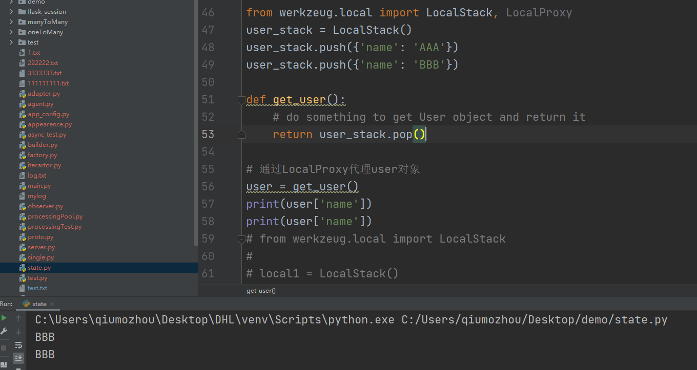
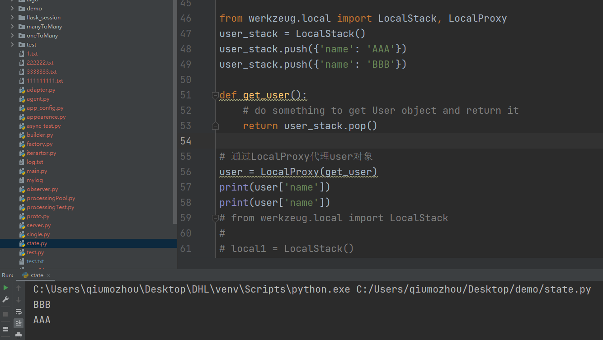

### 01、Local
简而言之,local对象用于存储每个线程的上下文
```
# 在有greenlet的情况下，get_indent实际获取的是greenlet的id，而没有greenlet的情况下获取的是thread id
try:
    from greenlet import getcurrent as get_ident
except ImportError:
    try:
        from thread import get_ident
    except ImportError:
        from _thread import get_ident

class Local(object):
    __slots__ = ('__storage__', '__ident_func__')

    def __init__(self):
        object.__setattr__(self, '__storage__', {})
        object.__setattr__(self, '__ident_func__', get_ident)

    def __iter__(self):
        return iter(self.__storage__.items())

    # 当调用Local对象时，返回对应的LocalProxy
    def __call__(self, proxy):
        """Create a proxy for a name."""
        return LocalProxy(self, proxy)

    # Local类中特有的method，用于清空greenlet id或线程id对应的dict数据
    def __release_local__(self):
        self.__storage__.pop(self.__ident_func__(), None)

    def __getattr__(self, name):
        try:
            return self.__storage__[self.__ident_func__()][name]
        except KeyError:
            raise AttributeError(name)

    def __setattr__(self, name, value):
        ident = self.__ident_func__()
        storage = self.__storage__
        try:
            storage[ident][name] = value
        except KeyError:
            storage[ident] = {name: value}

    def __delattr__(self, name):
        try:
            del self.__storage__[self.__ident_func__()][name]
        except KeyError:
            raise AttributeError(name)
```

### 02、LocalStack
LocalStack与Local对象类似，区别在于其数据结构是栈的形式，而Local是字典的形式
```
from werkzeug.local import LocalStack

local1 = LocalStack()
local1.push(42)
print(local1.top)
```


### 03、LocalProxy
LocalProxy用于代理Local对象和LocalStack对象
为什么要使用LocalProxy?
直接使用LocalStack对象，user一旦赋值就无法再动态更新了，而使用Proxy，每次调用操作符(这里[]操作符用于获取属性)，都会重新获取user，从而实现了动态更新user的效果



