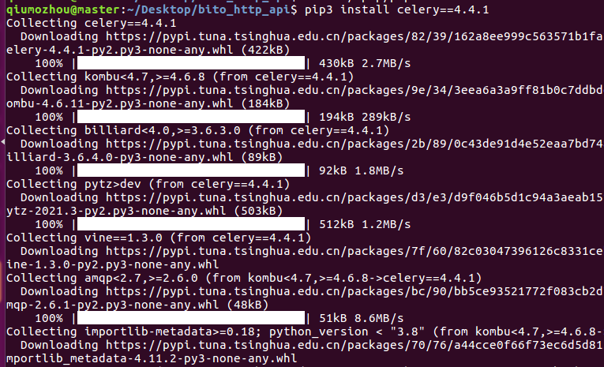
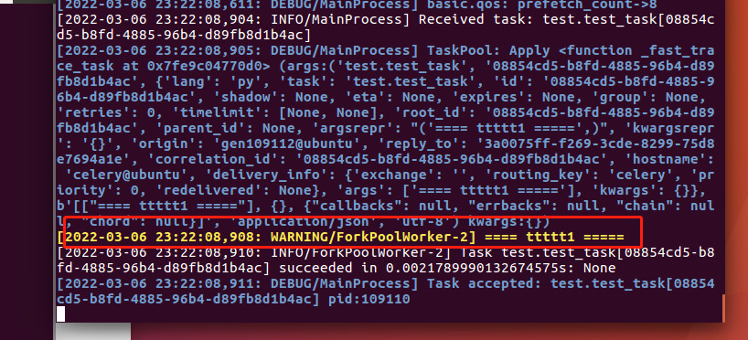
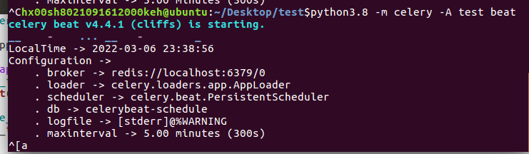
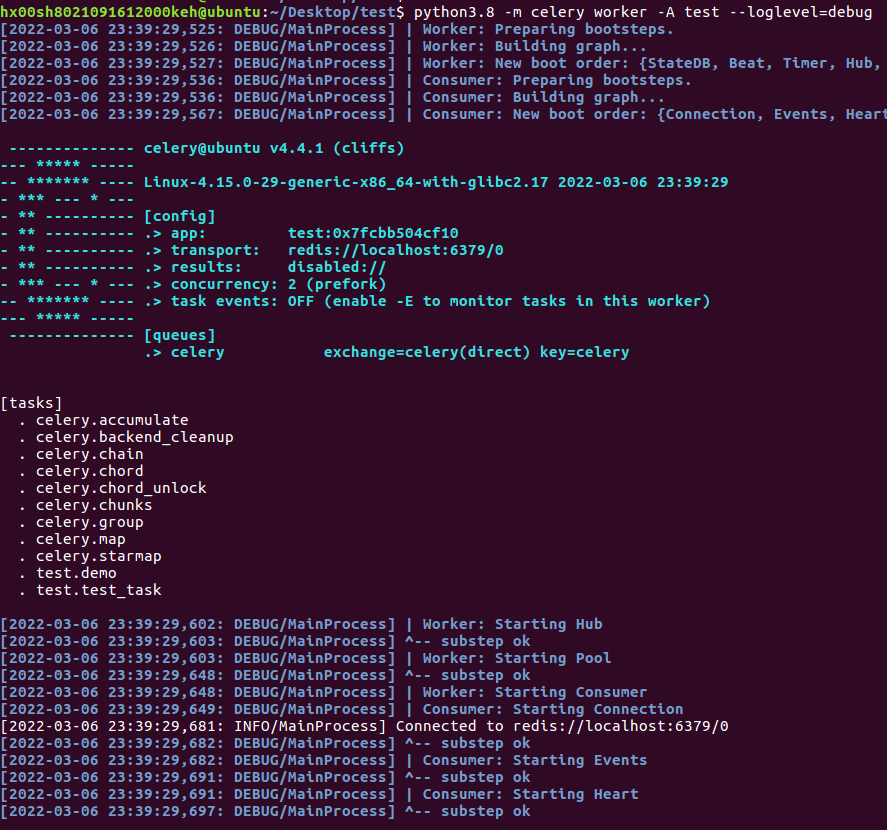

### 01、安装celery
执行`pip3.8 install celery==4.4.1`


### 02、编写异步任务代码
新建/test/test.py文件，拷贝如下代码:
```
from celery import Celery

celery_app = Celery('test', broker='redis://localhost:6379/0')

@celery_app.task
def test_task(n):
    print(n)

if __name__ == '__main__':
    test_task.delay('==== ttttt1 =====')

```

### 03、创建异步任务
进入test文件夹,执行`python3.8 test.py`


### 04、创建worker,消费任务
进入test文件夹,执行`python3.8 celery worker -A  test --loglevel=debug`



### 05、创建定时任务
在test.py中加入以下代码:
```
celery_app.conf.beat_schedule = {
    "test":{
        "task":"test.demo",
        #秒
        "schedule":5
    }
}

@celery.task
def demo():
    print(1111111)
```

### 06、执行定时任务
进入到test文件夹,执行`python3.8 -m celery -A test beat`,开始发布任务


进入到test文件夹,执行`python3.8 -m celery worker -A test --loglevel=debug`,开始执行任务



