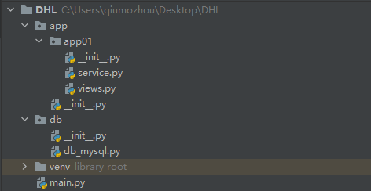

### 01、创建项目结构
如下:



### 02、修改main.py文件
```
from fastapi import FastAPI
import uvicorn

from app import app01

app = FastAPI()

# 注册子路由
app.include_router(app01,prefix='/api/v1/demo',tags=['业务路由一'])


if __name__ == '__main__':
    # 配置启动文件，主机，端口，代码更改重新加载，调试模式,进程数量
  uvicorn.run('main:app',host='0.0.0.0',port=8001,reload=True,debug=True,workers=1)
```

### 03、修改views.py文件
```
from fastapi import APIRouter
app01 = APIRouter()


@app01.get("/")
def read_root():
    return {"ok"}
```

### 04、挂载子路由
```
from .app01.views import app01
```
修改文件如下:


### 05、启动服务
在根目录下执行`python main.py`
