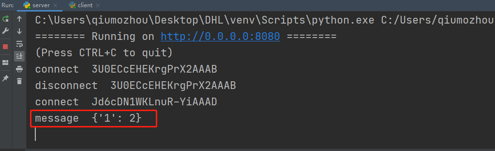

### 01、安装依赖包
(相关文档地址:https://python-socketio.readthedocs.io/en/latest/client.html)

执行`pip install python-socketio,aiohttp`


### 02、编写服务端

新建server.py文件，拷贝如下内容:
```
from aiohttp import web
import socketio

sio = socketio.AsyncServer()
app = web.Application()
sio.attach(app)

async def index(request):
    """Serve the client-side application."""
    with open('index.html') as f:
        return web.Response(text=f.read(), content_type='text/html')

@sio.event
def connect(sid, environ):
    print("connect ", sid)

@sio.event
async def chat_message(sid, data):
    print("message ", data)

@sio.event
def disconnect(sid):
    print('disconnect ', sid)

# app.router.add_static('/static', 'static')
# app.router.add_get('/', index)

if __name__ == '__main__':
    web.run_app(app)
```

### 03、编写客户端
新建client.py文件，拷贝如下内容:
```
import asyncio
import socketio

sio = socketio.AsyncClient()

@sio.event
async def connect():
    print('connection established')

@sio.event
async def my_message(data):
    print('message received with ', data)
    await sio.emit('my response', {'response': 'my response'})

@sio.event
async def disconnect():
    print('disconnected from server')

async def main():
    await sio.connect('http://127.0.0.1:8080')
    await sio.emit("chat_message",{"1":2})
    await sio.wait()

if __name__ == '__main__':
    asyncio.run(main())
```

### 04、运行代码

分别执行`python server.py`和`python client.py`

会看到服务端接收到客户端发送过来的消息:


