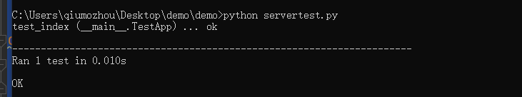

### 01、安装相关模块
执行`pip install requests`


### 02、编写测试用例
```
import unittest

import requests

class TestApp(unittest.TestCase):
    def setUp(self):
        pass

    def test_index(self):
        res = requests.post("http://127.0.0.1:8000/index")
        self.assertEqual(res.status_code,200)

if __name__ == "__main__":
    unittest.main(verbosity=2)
```


### 03、运行测试用例
可以看到该测试用例已通过

