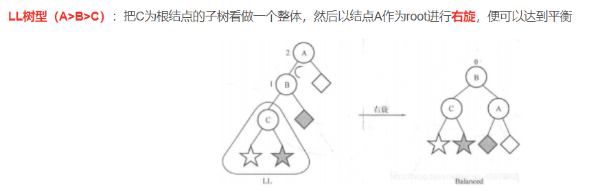
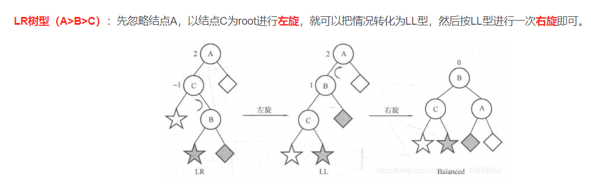
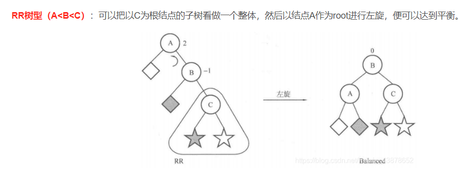
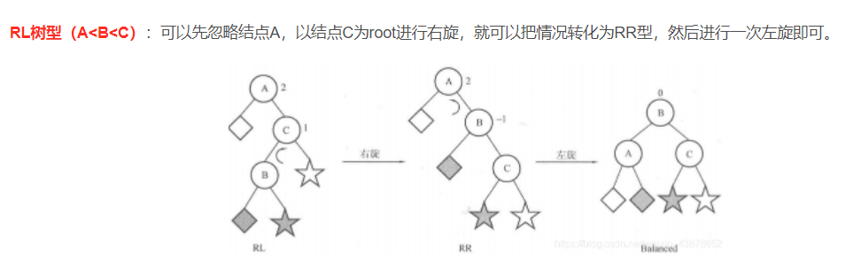

前言:平衡二叉树是任意一个节点,该节点的左子树跟右子树高度差不超过1。接下来手撕AVL二叉树


### 01、代码实现
```
# -*- ecoding: utf-8 -*-
# @ModuleName: avltree
# @Mail: 15717163552@163.com
# @Author: mozhouqiu
# @Time: 2022/5/20 9:05
from collections import deque


class AVLTreeNode:
    def __init__(self,val):
        self.data = val
        self.lchild = None
        self.rchild = None
        self.parent = None
        self.bf = 0


class AVLTree:
    def __init__(self):
        self.root = None

    # 前序遍历(递归实现)
    def pre_order(self, root):
        if root:
            print(root.data, end=',')
            self.pre_order(root.lchild)
            self.pre_order(root.rchild)

    # 中序遍历(递归实现)
    def in_order(self, root):
        if root:
            self.in_order(root.lchild)
            print(root.data, end=',')
            self.in_order(root.rchild)

    # 后序遍历(递归实现)
    def post_order(self, root):
        if root:
            self.post_order(root.lchild)
            self.post_order(root.rchild)
            print(root.data, end=',')

    # 层次遍历(广度优先):
    def level_order(self, root):
        queue = deque()
        queue.append(root)
        while len(queue) > 0:
            node = queue.popleft()
            print(node.data, end=',')
            if node.lchild:
                queue.append(node.lchild)
            if node.rchild:
                queue.append(node.rchild)

    def rotate_left(self,p,c):
        s2 = c.lchild
        p.rchild = s2
        if s2:
            s2.parent = p

        c.lchild = p
        p.parent = c

        p.bf = 0
        c.bf = 0
        return c

    def rotate_right(self,p,c):
        s2 = c.rchild
        p.lchild = s2
        if s2:
             s2.parent = p

        c.lchild = p
        p.parent = c

        p.bf = 0
        c.bf = 0
        return c

    def rotate_right_left(self,p,c):
        g = c.lchild
        s3 = g.rchild
        c.lchild = s3
        if s3:
            s3.parent = c
        g.rchild = c
        c.parent = g

        s2 = g.lchild
        p.rchlid = s2
        if s2:
            s2.parent = p
        g.lchild = p
        p.parent = g

        if g.bf > 0:
            p.bf = -1
            c.bf = 0
        elif g.bf < 0:
            p.bf = 0
            c.bf = 1
        else:
            p.bf = 0
            c.bf = 0
        return g

    def rotate_left_right(self,p,c):
        g = c.rchild

        s2 = g.lchild
        c.rchild = s2
        if s2:
            s2.parent = c
        g.lchild = c
        c.parent = g

        s3 = g.rchild
        p.lchild = s3
        if s3:
            s3.parent = p
        g.rchild = p
        p.parent = g

        if g.bf < 0:
            p.bf = 1
            c.bf = 0
        elif g.bf > 0:
            p.bf = 0
            c.bf = -1
        else:
            p.bf = 0
            c.bf = 0
        return g

    # 插入非递归实现
    def insert_no_rec(self, val):
        if not self.root:
            self.root = AVLTreeNode(val)
        else:
            p = self.root
            while True:
                if val < p.data:
                    if not p.lchild:
                        p.lchild = AVLTreeNode(val)
                        p.lchild.parent = p
                        node = p.lchild
                        break
                    else:
                        p = p.lchild
                elif val > p.data:
                    if not p.rchild:
                        p.rchild = AVLTreeNode(val)
                        p.rchild.parent = p
                        node = p.rchild
                        break
                    else:
                        p = p.rchild
                else:
                    raise ValueError("repetitive value")

            while node.parent:
                if node.parent.lchild == node:
                    if node.parent.bf < 0:
                        g = node.parent.parent
                        x = node.parent
                        if node.bf>0:
                            n = self.rotate_left_right(node.parent,node)
                        else:
                            n = self.rotate_right(node.parent,node)
                    elif node.parent.bf > 0:
                        node.parent.bf = 0
                        break
                    else:
                        node.parent.bf = -1
                        node = node.parent
                        continue
                else:
                    if node.parent.bf > 0:
                        g = node.parent.parent
                        x = node.parent
                        if node.bf<0:
                            n = self.rotate_right_left(node.parent,node)
                        else:
                            n = self.rotate_left(node.parent,node)
                    elif node.parent.bf<0:
                        node.parent.bf=0
                        break
                    else:
                        node.parent.bf=1
                        node = node.parent
                        continue
                n.parent = g
                if g:
                    if x == g.lchild:
                        g.lchild = n
                    else:
                        g.rchild = n
                    break
                else:
                    self.root=n
                    break


avl = AVLTree()
avl.insert_no_rec(1)
avl.insert_no_rec(2)
avl.insert_no_rec(3)
avl.insert_no_rec(4)
avl.insert_no_rec(5)
avl.insert_no_rec(6)
avl.insert_no_rec(7)

avl.level_order(avl.root)
avl.in_order(avl.root)

```

参考:







