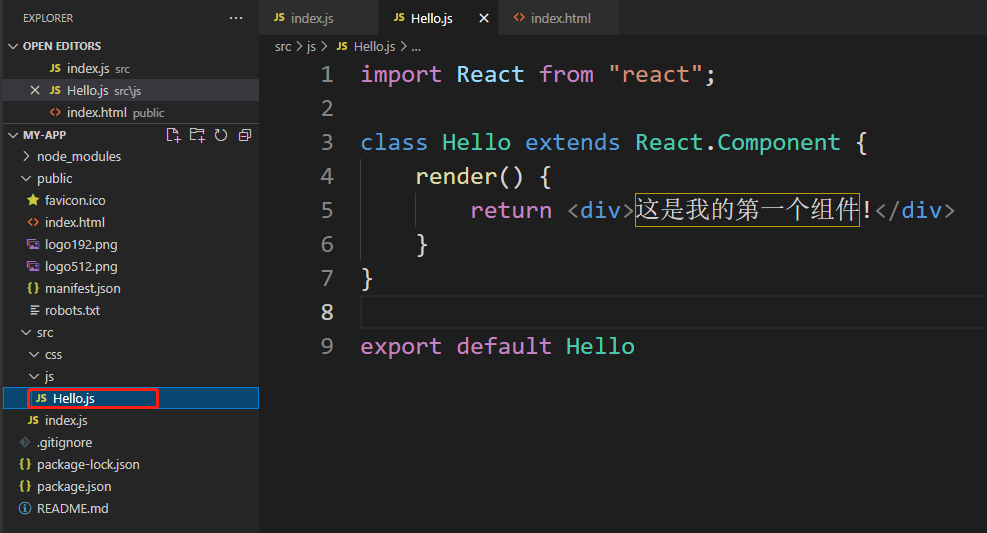
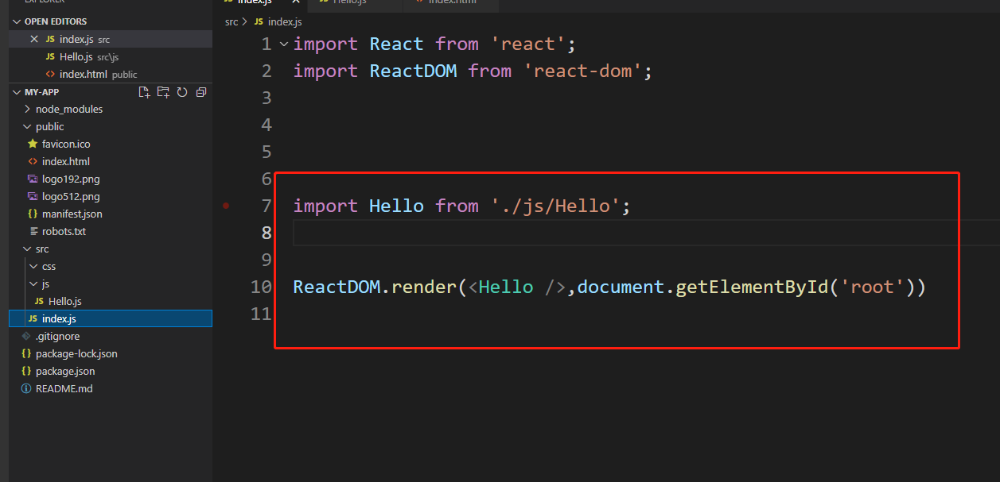

### 01、使用函数创建组件

```
function Hello(){
    return (
        <div>这是我的第一个组件!</div>
    )
}


ReactDOM.render(<Hello />,document.getElementById('root'))
```

注意：

      1.函数名称必须以大写字母开头

      2.函数组件必须有返回值，表示该组件的结构


### 02、使用类创建组件

```
class Hello extends React.Component{
    render(){
        return <div>这是我的第一个组件!</div>
    }
}

ReactDOM.render(<Hello />,document.getElementById('root'))
```

注意：

      1.类名称必须以大写字母开头

      2.类组件应该继承React.Component父类，从而可以使用父类中的属性或方法

      3.类组件必须实现render()方法

      4.render()方法必须有返回值，表示该结构的组件


### 03、抽离为独立的js文件

1、创建Hello.js

2、在Hello.js中导入React

3、创建组件(函数或类)

4、在Hello.js中导出该组件


5、在index.js中导入该组件
6、渲染组件 



