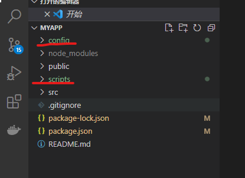
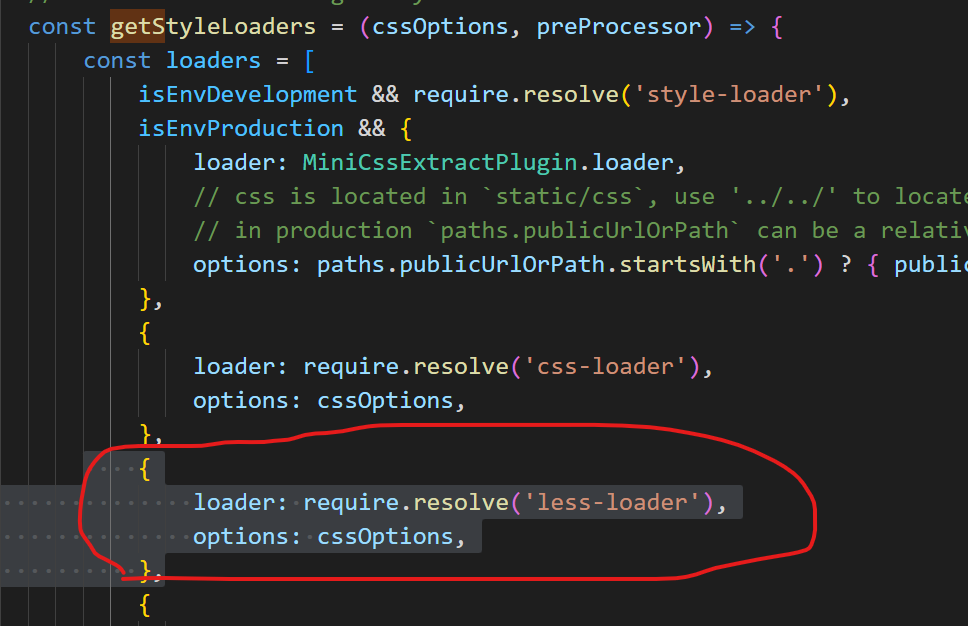
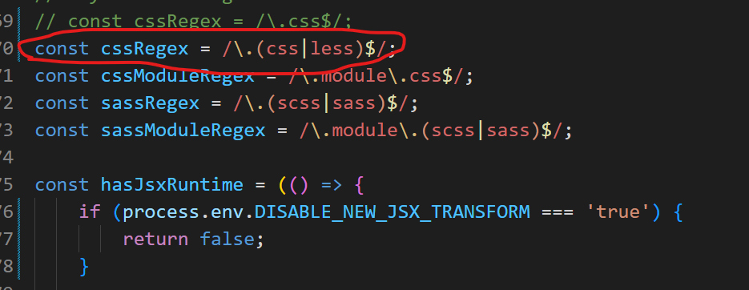
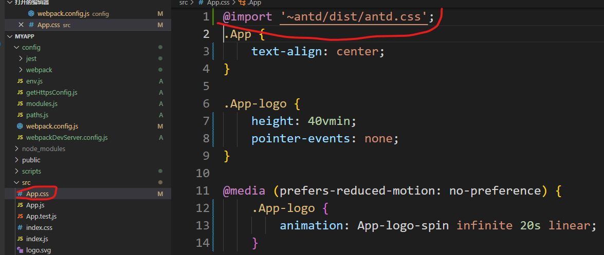

### 01、安装包
```
 npm install less less-loader --save

 npm add antd
```


### 02、导出webpack配置文件
执行`npm run eject`,会生成config,scripts两个文件夹



### 03、修改webpack.config.js
```
const cssRegex = /\.css$/ 修改为 const cssRegex = /\.(css|less)$/;


getStyleLoaders中新增
    {
                loader: require.resolve('less-loader'),
                options: cssOptions,
            },
```






### 04、引入antd
修改 src/App.css，在文件顶部引入antd/dist/antd.css
```
@import '~antd/dist/antd.css';
```




