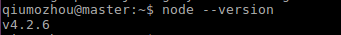

### 01、下载源码
在 Github 上获取 Node.js 源码：
`sudo git clone https://github.com/nodejs/node.git`

### 02、修改目录权限
`sudo chmod -R 755 node`


### 03、创建编译文件

```
cd node
sudo ./configure
sudo make
sudo make install
```

### 04、查看node版本:

`node --version`


