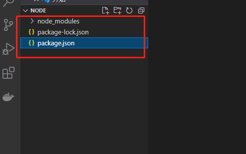

### 01、安装 Express并将其保存到依赖列表中：

在项目根路径中执行`npm install express --save`




### 02、安装其它依赖

继续执行

`npm install body-parser --save`     
node.js 中间件，用于处理 JSON, Raw, Text 和 URL 编码的数据。

`npm install cookie-parser --save`   
这就是一个解析Cookie的工具。通过req.cookies可以取到传过来的cookie，并把它们转成对象。

`npm install multer --save`          
node.js 中间件，用于处理 enctype="multipart/form-data"（设置表单的MIME编码）的表单数据。


### 03、创建入口文件

在项目根目录下创建index.js文件,拷贝如下代码(表示跟flask太像了):

```
//express_demo.js 文件
var express = require('express');
var app = express();
 
app.get('/', function (req, res) {
   res.send('Hello World');
})
 
var server = app.listen(8081, function () {
 
  var host = server.address().address
  var port = server.address().port
 
  console.log("应用实例，访问地址为 http://%s:%s", host, port)
 
})
```


### 04、启动服务

在当前项目中执行`node index.js`,然后访问"http://localost:8081"


## 扩展:
```
Request 对象 - request 对象表示 HTTP 请求，包含了请求查询字符串，参数，内容，HTTP 头部等属性。常见属性有：

req.app：当callback为外部文件时，用req.app访问express的实例
req.baseUrl：获取路由当前安装的URL路径
req.body / req.cookies：获得「请求主体」/ Cookies
req.fresh / req.stale：判断请求是否还「新鲜」
req.hostname / req.ip：获取主机名和IP地址
req.originalUrl：获取原始请求URL
req.params：获取路由的parameters
req.path：获取请求路径
req.protocol：获取协议类型
req.query：获取URL的查询参数串
req.route：获取当前匹配的路由
req.subdomains：获取子域名
req.accepts()：检查可接受的请求的文档类型
req.acceptsCharsets / req.acceptsEncodings / req.acceptsLanguages：返回指定字符集的第一个可接受字符编码
req.get()：获取指定的HTTP请求头
req.is()：判断请求头Content-Type的MIME类型


Response 对象 - response 对象表示 HTTP 响应，即在接收到请求时向客户端发送的 HTTP 响应数据。常见属性有：

res.app：同req.app一样
res.append()：追加指定HTTP头
res.set()在res.append()后将重置之前设置的头
res.cookie(name，value [，option])：设置Cookie
opition: domain / expires / httpOnly / maxAge / path / secure / signed
res.clearCookie()：清除Cookie
res.download()：传送指定路径的文件
res.get()：返回指定的HTTP头
res.json()：传送JSON响应
res.jsonp()：传送JSONP响应
res.location()：只设置响应的Location HTTP头，不设置状态码或者close response
res.redirect()：设置响应的Location HTTP头，并且设置状态码302
res.render(view,[locals],callback)：渲染一个view，同时向callback传递渲染后的字符串，如果在渲染过程中有错误发生next(err)将会被自动调用。callback将会被传入一个可能发生的错误以及渲染后的页面，这样就不会自动输出了。
res.send()：传送HTTP响应
res.sendFile(path [，options] [，fn])：传送指定路径的文件 -会自动根据文件extension设定Content-Type
res.set()：设置HTTP头，传入object可以一次设置多个头
res.status()：设置HTTP状态码
res.type()：设置Content-Type的MIME类型
```
