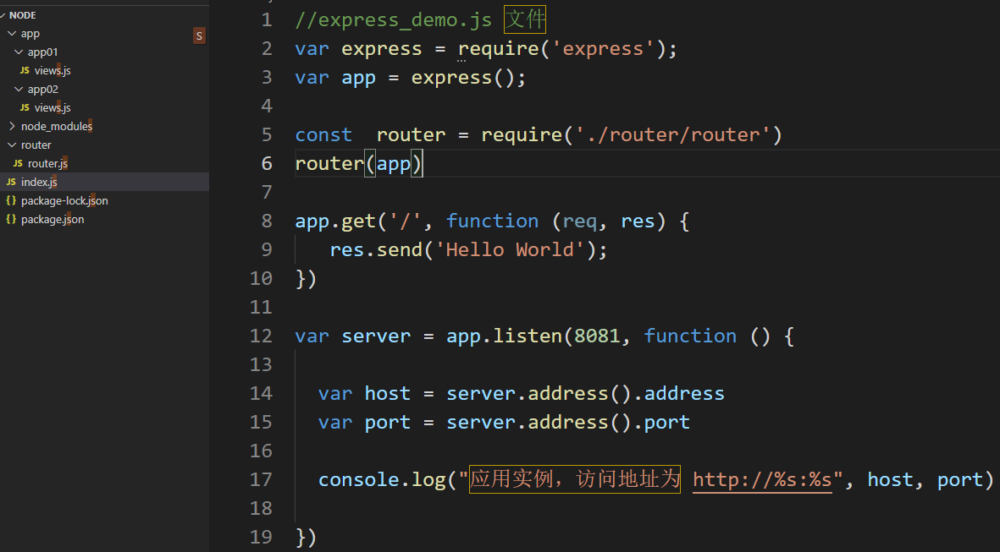

前言:
    在任何一个web框架中,路由分层都是很必要的，它可以使项目结构更清晰


### 01、创建项目结构
如下图:


### 02、修改router.js文件
拷贝如下代码:
```
function router(app) {
    app.use('/app1', require('../app/app01/views'))
    app.use('/app2', require('../app/app02/views'))
}

module.exports = router;
```

### 03、修改index.js
拷贝如下代码:
```
//express_demo.js 文件
var express = require('express');
var app = express();


# 挂载子路由
const  router = require('./router/router')
router(app)

app.get('/', function (req, res) {
   res.send('Hello World');
})
 
var server = app.listen(8081, function () {
 
  var host = server.address().address
  var port = server.address().port
 
  console.log("应用实例，访问地址为 http://%s:%s", host, port)
 
})
```


### 04、修改业务代码:
修改/app/app01/views.js文件
```
var router = require('express').Router();
//最终的路由模块

router.get('/test',function (req,res,) {
    res.send('我是app01模块');
})
module.exports =  router
```


### 05、启动服务并访问
执行`node index.js`


