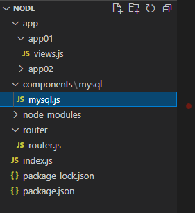
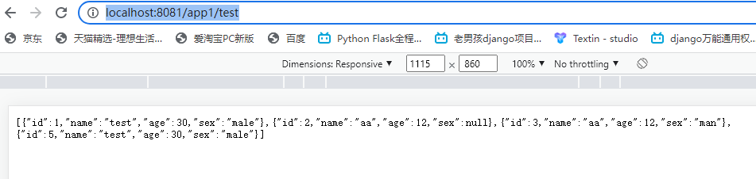

### 01、安装依赖包

执行`npm install mysql`

### 02、封装mysql模块
项目结构如下:



拷贝如下代码至mysql.js
```
var mysql      = require('mysql');
var connection = mysql.createConnection({
  host     : 'localhost',
  user     : 'root',
  password : '123456',
  database : 'demo'
});
    
connection.connect();
//执行SQL的函数
function exec(sql,params) {
	const promise = new Promise((resolve,reject)=>{
		connection.query(sql, params, (err,result) => {
			if(err){
				reject(err);
				return;
			}
			resolve(result);
		})
	});
	return promise;
}

module.exports = exec
```

### 03、业务代码中使用mysql模块
```
var router = require('express').Router();
const exec = require('../../components/mysql/mysql')
//最终的路由模块

router.get('/test', function (req, res) {
    // res.send('我是app01模块');
    const sql = "select * from student;"
    exec(sql).then(data => {
        console.log(data)
        return res.jsonp(data)
    })
})


router.get('/add', function (req, res) {
    
    var sql = "INSERT INTO student(name,age,sex) VALUES(?,?,?)"
    var param = ["qiumozhou",18,"man"]
    exec(sql,param).then(data => {
        console.log(data)
        return res.jsonp(data)
    })
})

module.exports = router

```

### 04、重启服务并访问

执行`node index.js`,浏览器打开"http://localhost:8081/app1/test"




