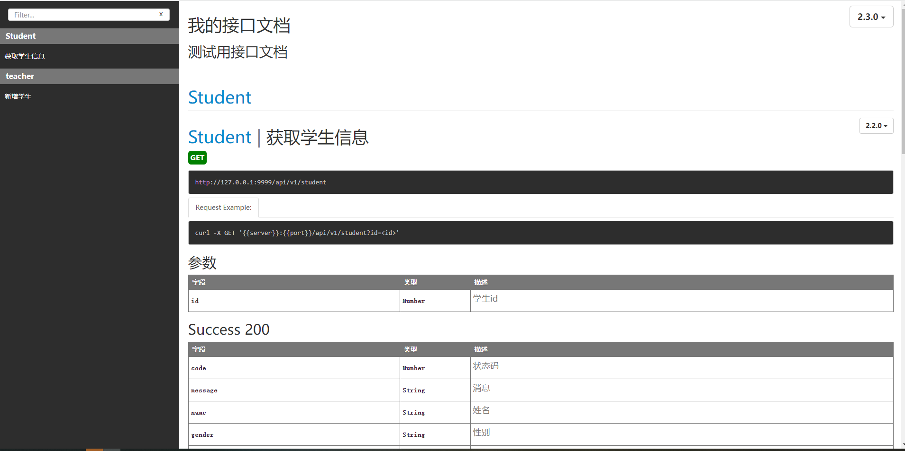

### 01、安装apidoc
apidoc是基于nodeJs平台，在安装apidoc之前，需要先安装nodejs和npm（安装步骤省略）。

执行`npm install apidoc -g`


### 02、编写配置文档
在项目根目录下创建apidoc.json文件,拷贝如下文件:
```
{
  "name": "我的接口文档",
  "version": "2.3.0",
  "description": "测试用接口文档",
  "title": "Qiumozhou",
  "url": "http://127.0.0.1:9999"
}
```

### 03、编写接口文档
拷贝如下代码至代码接口部分.

```
查询学生
 /**
  *         @api {GET} /api/v1/student 获取学生信息 
  *         @apiVersion 2.2.0
  *         @apiName getStudent
  *         @apiGroup Student

  *         @apiParam {Number} id 学生id

  *         @apiExample {curl} Request Example:
  *         curl -X GET '{{server}}:{{port}}/api/v1/student?id=<id>'

  *         @apiSuccess {Number} code 状态码
  *         @apiSuccess {String} message 消息
  *         @apiSuccess {String} name 姓名
  *         @apiSuccess {String} gender 性别
  *         @apiSuccess {Number} age 年龄

  *         @apiSuccessExample {json} Response Example:
  *            HTTP/1.1 0 OK
  *            {
  *             "code": 0,
  *             "data": [{
  *                         "name": "qiumozhou",
  *                         "gender": "man",
  *                         "age": 18
  *                     }]
  *             "message": "Success"
  *         }
  */


新增学生
 /**
  *         @api {POST} /api/v1/student 新增学生 
  *         @apiVersion 2.2.0
  *         @apiName addStudent
  *         @apiGroup Student

  *         @apiExample {curl} Request Example:
  *     curl -H "Content-Type:application/json" -X POST -d 'data' {{server}}:{{port}}/api/v1/student

  *         @apiParam {String} name 姓名
  *         @apiParam {String} gender 性别
  *         @apiParam {Number} age 年龄 

  *          @apiParamExample {json} Request Example:
  *              {
  *                  "name": "qiumozhou",
*                 "gender": "man"
  *                "age" : 18
  *              }

  *         @apiSuccess {Number} code 状态码
  *         @apiSuccess {String} message 消息
  *         @apiSuccess {Number} id 学生id

  *         @apiSuccessExample {json} Response Example:
  *            HTTP/1.1 0 OK
  *            {
  *             "code": 0,
  *             "data": {
  *                         "id": 1,
  *                     }
  *             "message": "Success"
  *         }
  */
```

### 04、生成接口文档
在项目根路径下执行`apidoc -i ./ -o ./apidoc`,会发现生成apidoc文件夹,打开其中的index.html,即可看到相关接口说明




