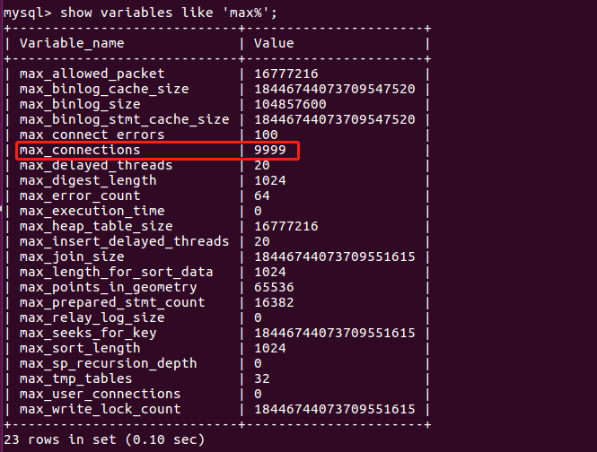
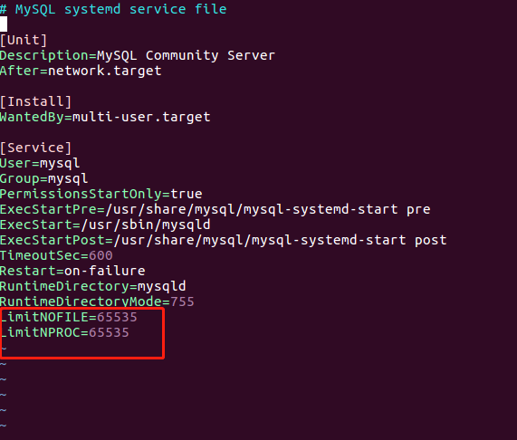

#### 01、查看最大连接数
`show variables like 'max%';`


#### 02、打开配置文件
`sudo vim /etc/mysql/my.cnf`

#### 03、文件结尾添加
```
[mysqld]
max_connections=500
```


#### 04、修改配置文件
`sudo vim /lib/systemd/system/mysql.service`
在文件最下面添加
```
LimitNOFILE=65535
LimitNPROC=65535
```


#### 05、重启服务
systemctl daemon-reload
systemctl restart mysql.service