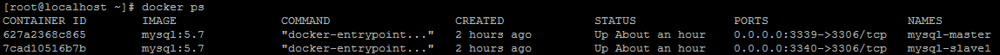
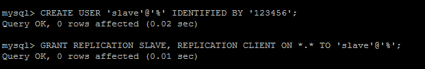
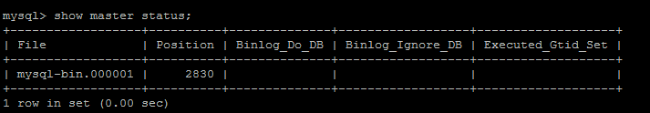
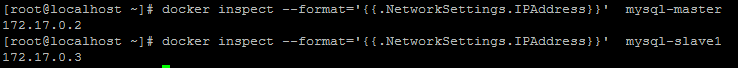
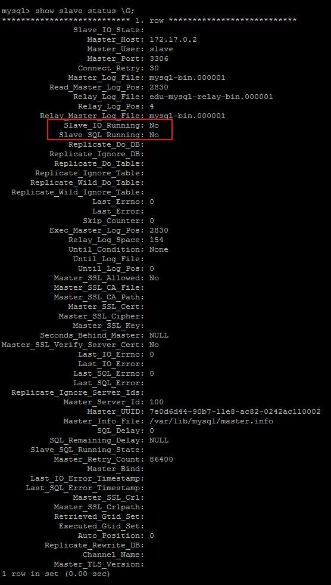
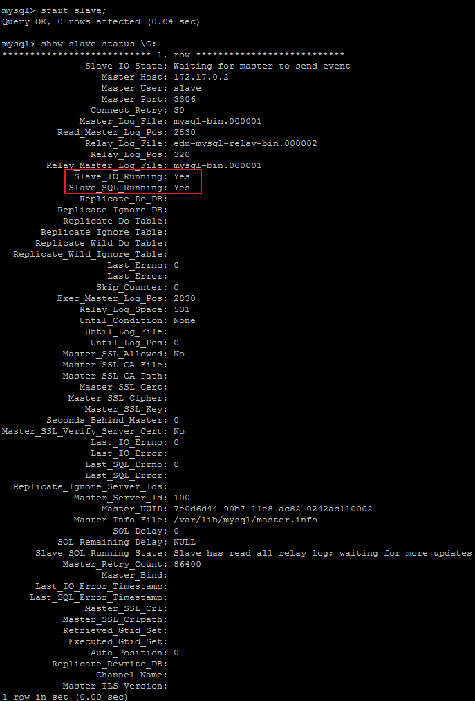

## 为什么基于Docker搭建
- 资源有限
- 虚拟机搭建对机器配置有要求，并且安装mysql步骤繁琐
- 一台机器上可以运行多个Docker容器
- Docker容器之间相互独立，有独立ip，互不冲突
- Docker使用步骤简便，启动容器在秒级别

## 利用Docker搭建主从服务器
### 01、拉取镜像

首先拉取docker镜像,我们这里使用5.7版本的mysql：

`docker pull mysql:5.7`

然后使用此镜像启动容器，这里需要分别启动主从两个容器


##### Master(主)：

    docker run -p 3339:3306 --name mymysql -e MYSQL_ROOT_PASSWORD=123456 -d mysql:5.7

#### Slave(从)：

    docker run -p 3340:3306 --name mymysql -e MYSQL_ROOT_PASSWORD=123456 -d mysql:5.7

>Master对外映射的端口是3339，Slave对外映射的端口是3340。因为docker容器是相互独立的，每个容器有其独立的ip，所以不同容器使用相同的端口并不会冲突。这里我们应该尽量使用mysql默认的3306端口，否则可能会出现无法通过ip连接docker容器内mysql的问题。

使用docker ps命令查看正在运行的容器：



### 02、配置Master
通过`docker exec -it 627a2368c865 /bin/bash`命令进入到Master容器内部，也可以通过`docker exec -it mysql-master /bin/bash`命令进入。627a2368c865是容器的id,而mysql-master是容器的名称。

`cd /etc/mysql`切换到/etc/mysql目录下，然后vi my.cnf对my.cnf进行编辑。此时会报出bash: vi: command not found，需要我们在docker容器内部自行安装vim。使用`apt-get install vim`命令安装vim

会出现如下问题：

```
Reading package lists... Done
Building dependency tree       
Reading state information... Done
E: Unable to locate package vim
```

执行`apt-get update`，然后再次执行`apt-get install vim`即可成功安装vim。然后我们就可以使用vim编辑my.cnf，在my.cnf中添加如下配置：

```
[mysqld]
## 同一局域网内注意要唯一
server-id=100  
## 开启二进制日志功能，可以随便取（关键）
log-bin=mysql-bin
```

配置完成之后，需要重启mysql服务使配置生效。使用`service mysql restart`完成重启。重启mysql服务时会使得docker容器停止，我们还需要`docker start mysql-master`启动容器。

下一步在Master数据库创建数据同步用户，授予用户 slave REPLICATION SLAVE权限和REPLICATION CLIENT权限，用于在主从库之间同步数据。

CREATE USER 'slave'@'%' IDENTIFIED BY '123456';

GRANT REPLICATION SLAVE, REPLICATION CLIENT ON *.* TO 'slave'@'%';



### 03、配置Slaver
和配置Master(主)一样，在Slave配置文件my.cnf中添加如下配置：
```
[mysqld]
## 设置server_id,注意要唯一
server-id=101  
## 开启二进制日志功能，以备Slave作为其它Slave的Master时使用
log-bin=mysql-slave-bin   
## relay_log配置中继日志
relay_log=edu-mysql-relay-bin  
```
配置完成后也需要重启mysql服务和docker容器，操作和配置Master(主)一致。

### 04、链接Master和Slaver
在Master进入mysql，执行`show master status;`



File和Position字段的值后面将会用到，在后面的操作完成之前，需要保证Master库不能做任何操作，否则将会引起状态变化，File和Position字段的值变化

在Slave 中进入 mysql，执行
```
change master to master_host='172.17.0.2', master_user='slave', master_password='123456', master_port=3306, master_log_file='mysql-bin.000001', master_log_pos= 2830, master_connect_retry=30;
```


    master_port：Master的端口号，指的是容器的端口号

    master_user：用于数据同步的用户

    master_password：用于同步的用户的密码

    master_log_file：指定 Slave 从哪个日志文件开始复制数据，即上文中提到的 File 字段的值

    master_log_pos：从哪个 Position 开始读，即上文中提到的 Position 字段的值

    master_connect_retry：如果连接失败，重试的时间间隔，单位是秒，默认是60秒


在Slave 中的mysql终端执行`show slave status \G;`用于查看主从同步状态。



正常情况下，SlaveIORunning 和 SlaveSQLRunning 都是No，因为我们还没有开启主从复制过程。使用start slave开启主从复制过程，然后再次查询主从同步状态`show slave status \G;`。



SlaveIORunning 和 SlaveSQLRunning 都是Yes，说明主从复制已经开启。此时可以测试数据同步是否成功。
