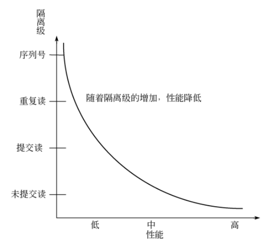
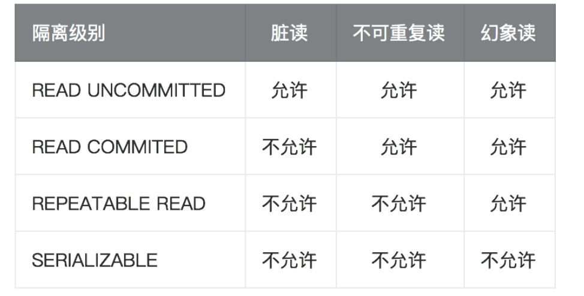

### 01、四种隔离级别
序列化（SERIALIZABLE）
```
如果隔离级别为序列化，则用户之间通过一个接一个顺序地执行当前的事务，这种隔离级别提供了事务之间最大限度的隔离
```


可重复读（REPEATABLE READ）
```
在可重复读在这一隔离级别上，事务不会被看成是一个序列。不过，当前正在执行事务的变化仍然不能被外部看到，也就是说，如果用户在另外一个事务中执行同条 SELECT 语句数次，结果总是相同的。（因为正在执行的事务所产生的数据变化不能被外部看到）。
```

提交读（READ COMMITTED）
```
READ COMMITTED 隔离级别的安全性比 REPEATABLE READ 隔离级别的安全性要差。处于 READ COMMITTED 级别的事务可以看到其他事务对数据的修改。也就是说，在事务处理期间，如果其他事务修改了相应的表，那么同一个事务的多个 SELECT 语句可能返回不同的结果。
```

未提交读（READ UNCOMMITTED）
```
READ UNCOMMITTED 提供了事务之间最小限度的隔离。除了容易产生虚幻的读操作和不能重复的读操作外，处于这个隔离级的事务可以读到其他事务还没有提交的数据，如果这个事务使用其他事务不提交的变化作为计算的基础，然后那些未提交的变化被它们的父事务撤销，这就导致了大量的数据变化。
```

性能关系如下:




### 02、隔离级别对应的问题

脏读
```
一个事务读到另外一个事务还没有提交的数据，称之为脏读
```


不可重复读
```
不可重复读是指一个事务先后读取同一条记录，但两次读取的数据不同，称之为不可重复读
```


幻象读
```
主要针对插入,删除操作。一个事务插入或删除了某条数据,导致另一个事务前后两次读取的数据不一样
```

每种隔离级别与其问题对应的关系如下:




### 03、查看事务级别
执行`show variables like '%tx_isolation%'`


### 04、修改事务级别

SET [SESSION | GLOBAL] TRANSACTION ISOLATION LEVEL {READ UNCOMMITTED | READ COMMITTED | REPEATABLE READ | SERIALIZABLE}

执行`SET GLOBAL TRANSACTION ISOLATION LEVEL READ UNCOMMITTED`