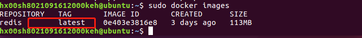
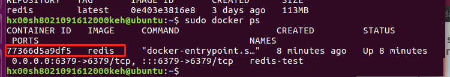
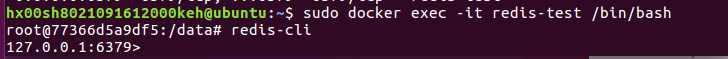

### 01、拉取redis镜像
在终端下输入`docker pull redis:latest`

### 02、查看本地镜像
在终端下输入`docker images`

### 03、运行容器
安装完成后，我们可以使用以下命令来运行 redis 容器：
`docker run -itd --name redis-test -p 6379:6379 redis`

### 04、安装成功
最后我们可以通过`docker ps` 命令查看容器的运行信息：

接着我们通过 redis-cli 连接测试使用 redis 服务。
`docker exec -it redis-test /bin/bash`

