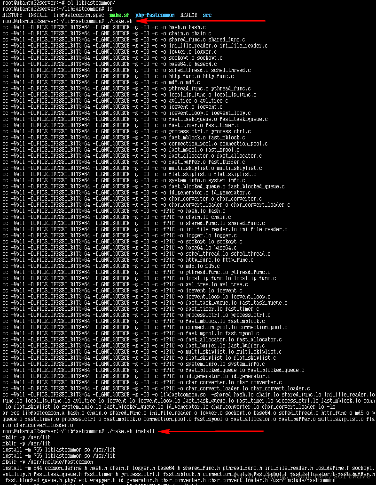
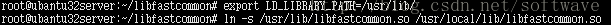
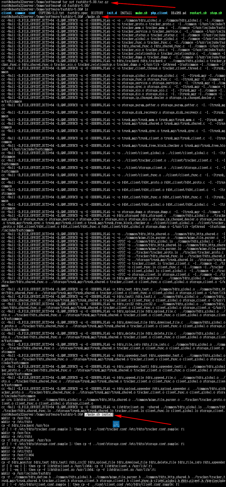
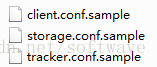
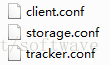
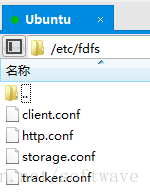
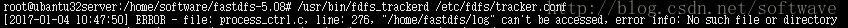
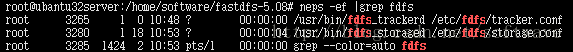
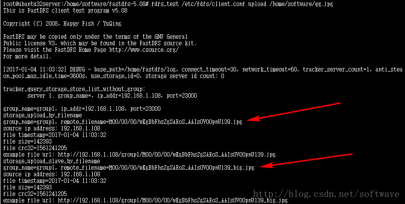

## 01、安装Git

fastdfs依赖libfastcommon，需要从github上clone到本地编译安装。因此首先需要安装git。

执行命令：

`apt-get install git`

## 02、克隆libfastcommon库
libfastcommon的源在项目 https://github.com/happyfish100/libfastcommon 需要使用git将其clone至本地安装。

执行命令：
`
git clone https://github.com/happyfish100/libfastcommon.git
`

## 03、安装libfastcommon依赖

进入libfastcommon目录，依次执行脚本：

`./make.sh`

和

`./make.sh install`

如图：

<!--  -->

注意:

   执行make.sh失败,是由于当前Linux版本中没有相应的编译环境

解决:

    安装build-essential的软件包，就可以一次将编译器、make工具、所有的编程头文件、函数库等东东全部安装上，其中也包括gcc编译器，这是非常稳妥的安装方式，

    安装命令是用root用户身份执行： apt-get install build-essential

## 04、设置环境变量和软链接
在32位ubuntu中，libfastcommon会安装在/usr/lib 中，64位系统则安装在 /usr/lib64 中。依次执行以下命令：（根据自己的操作系统选择路径）
     
    export LD_LIBRARY_PATH=/usr/lib/

和

    ln -s /usr/lib/libfastcommon.so /usr/local/lib/libfastcommon.so

## 05、下载、解压并安装FastDFS

FastDFS的Github下载地址为：https://github.com/happyfish100/fastdfs/releases

    tar xzf fastdfs-5.08.tar.gz 

进入解压后的目录，依次执行：

    ./make.sh 

和
     
    ./make.sh install

ubuntu fastdfs ./make.sh install 执行报错

    ln: failed to create symbolic link ‘/usr/lib64/libfastcommon.so’: No such file or directory
    ln: failed to create symbolic link ‘/usr/lib64/libfdfsclient.so’: No such file or directory

解决

修改文件，client/fdfs_link_library.sh.in

    #查找：
    ln -fs $TARGET_LIB/libfastcommon.so.1 /usr/lib64/libfastcommon.so
    ln -fs $TARGET_LIB/libfdfsclient.so.1 /usr/lib64/libfdfsclient.so
     
    #替换成：
    ln -fs $TARGET_LIB/libfastcommon.so.1 /usr/lib/libfastcommon.so
    ln -fs $TARGET_LIB/libfdfsclient.so.1 /usr/lib/libfdfsclient.so
    

如图：

## 06、修改配置文件

在默认安装路径 /etc/fdfs 下，有三个示例配置文件：

首先将这三个文件名中的sample去掉，改为：

然后修改 tracker.conf 文件中的日志存放路径 和 tracker server HTTP端口号：

    # the base path to store data and log files

    base_path=/home/fastdfs/log

注意，这个路径是根据实际情况自定义的，文件路径需要安装者手动创建，否则后续步骤会报“路径不存在”的错误，下同。

    # HTTP port on this tracker server

    http.server_port=8090

接下来修改 storage.conf 文件：

    group_name=group1
    
    store_path0=/home/fastdfs/storage0
    
    base_path=/home/fastdfs/log
    
    tracker_server=192.168.1.108:22122
    
    http.server_port=8888

配置文件里有详细注释说明，这里不再赘述每个参数的作用。

继续修改 client.conf 文件：

    base_path=/home/fastdfs/log

    tracker_server=192.168.1.108:22122

    http.tracker_server_port=8888

    #include http.conf

注意，#include http.conf 这句，原配置文件中有2个#，删掉一个。

最后，修改 http.conf 文件。http.conf 文件在解压目录的conf目录下，里面有个默认图片路径，愿意改就改了吧。

    http.anti_steal.token_check_fail=/home/fastdfs/anti-steal.jpg

最后确认一下，四个配置文件：

## 07、启动服务
依次执行：

    /usr/bin/fdfs_trackerd /etc/fdfs/tracker.conf

    /usr/bin/fdfs_storaged /etc/fdfs/storage.conf

如果上一步配置文件中的自定义路径没创建，有可能报这个错误：

手动创建目录即可。
执行以下命令，验证服务：

    ps -ef |grep fdfs

## 08、测试上传文件

首先准备一张图片文件，例如：/home/software/qq.jpg

将这张图片上传至FastDFS，执行：

    fdfs_test /etc/fdfs/client.conf upload /home/software/qq.jpg

## 09、测试下载文件

在任意目录下执行：

    fdfs_test /etc/fdfs/client.conf download group_name remote_filename 