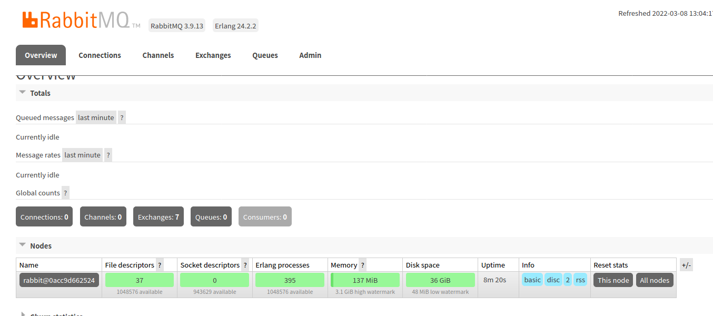

### 01、拉取镜像
```
#推荐拉取带管理界面版本
docker pull rabbitmq:management

#若指定版本
docker pull rabbitmq:3.8.4-management

#查看镜像
docker images
```

### 02、构建容器并运行
```
#不指定用户名密码，默认为guest/guest
docker run --name=rabbitmq-server -p 15672:15672 -p 5672:5672 -d rabbitmq:management

#指定用户名密码
docker run --name=rabbitmq-server -p 15672:15672 -p 5672:5672 -e RABBITMQ_DEFAULT_USER=admin -e RABBITMQ_DEFAULT_PASS=admin -d rabbitmq:management

#查看运行状态
docker ps -a
```

### 03、开放端口
```
#查看防火墙状态（not running为未开启，running为开启中）
firewall-cmd --state
#方式一，直接关闭防火墙
systemctl stop firewalld.service
#方式二，开启15672端口并重启防火墙
firewall-cmd --zone=public --add-port=15672/tcp --permanent
systemctl restart firewalld.service
```

### 04、浏览器访问
（默认用户名密码：guest/guest）
`localhost:15672`
