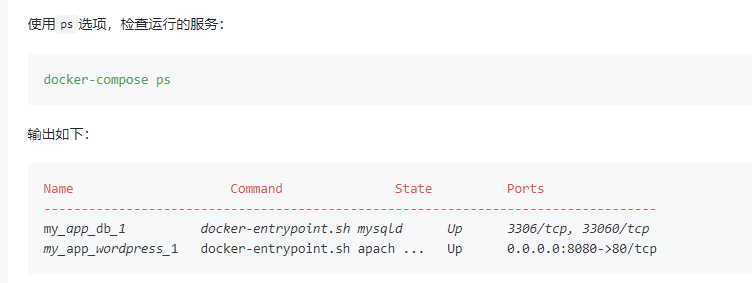

### 01、安装docker-compose
执行 `sudo apt-get install docker-compose`

### 02、编写配置文件
新建docker-compose.yml文件,粘贴以下内容:
```
version: '3'
services:
  db:
    image: mysql:5.7
    restart: always
    volumes:
      - db_data:/var/lib/mysql
    environment:
      MYSQL_ROOT_PASSWORD: password
      MYSQL_DATABASE: wordpress
  wordpress:
    image: wordpress
    restart: always
    volumes:
      - ./wp_data:/var/www/html
    ports:
      - "8080:80"
    environment:
      WORDPRESS_DB_HOST: db:3306
      WORDPRESS_DB_NAME: wordpress
      WORDPRESS_DB_USER: root
      WORDPRESS_DB_PASSWORD: password
    command:["bash","/test/start_up.sh"]
    depends_on:
       - db
volumes:
    db_data:
    wp_data:
```

### 03、启动docker-compose
在docker-compose.yml路径执行`sudo docker-compose up -d`


### 04、检查容器
使用ps选项，检查运行的服务：
`sudo docker-compose ps` 
