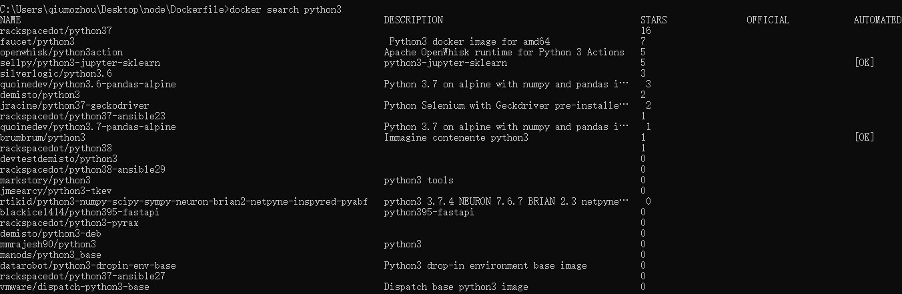
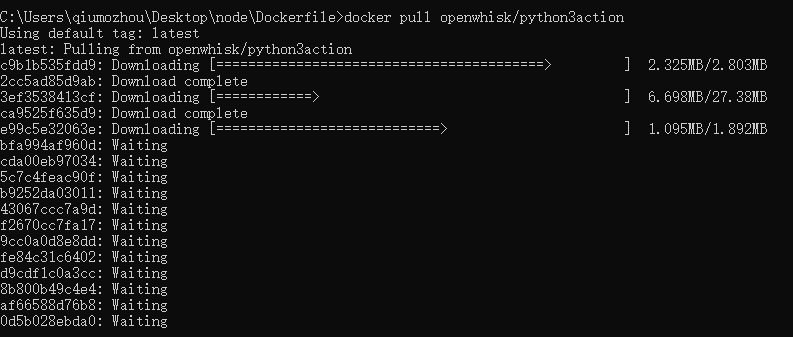
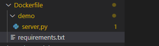
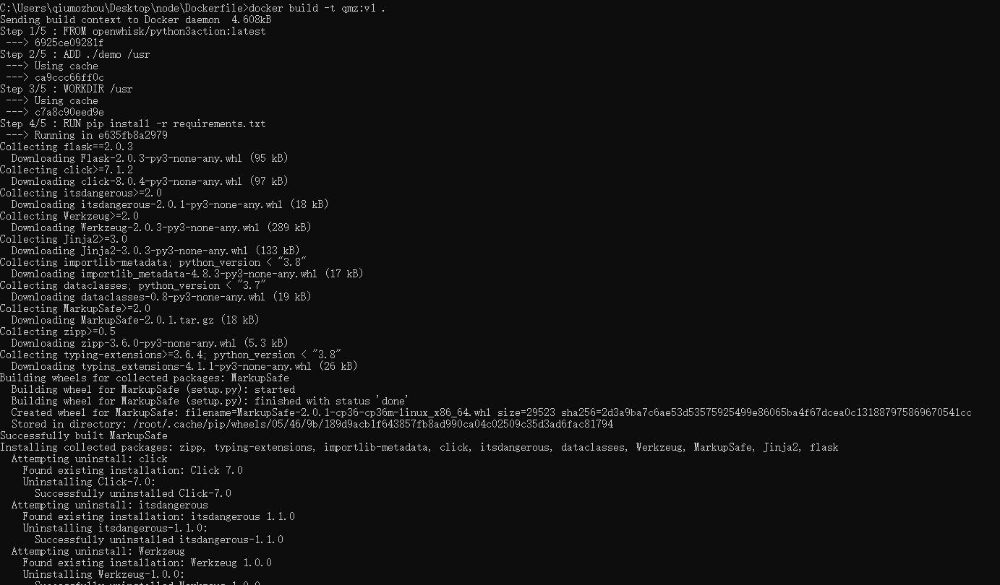

### 01、搜索基础镜像
执行`docker search python3.8`




### 02、拉取基础镜像
执行`docker pull openwhisk/python3action`,一般我们选择星级较多的基础镜像




### 03、新建Dockerfile文件夹
将python项目文件及requirements.txt放在Dockerfile目录下




### 04、编写配置文件
在Dockerfile目录下新建Dockerfile文件,并拷贝如下内容:
```
#基于的基础镜像
FROM openwhisk/python3action:latest

#代码添加到usr文件夹
ADD ./demo /usr

# 设置code文件夹是工作目录
WORKDIR /usr

# 安装支持
RUN pip install -r requirements.txt

CMD ["python", "/usr/server.py"]
```

### 05、制作镜像
在Dockerfile目录下执行`docker build -t qmz:v1 .`




### 06、运行容器
执行`docker run -p 9000:9000 -d  qmz:v1`,访问"http://localhost:9000"


