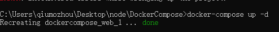

### 01、安装Compose
执行`sudo curl -L "https://github.com/docker/compose/releases/download/v2.2.2/docker-compose-$(uname -s)-$(uname -m)" -o /usr/local/bin/docker-compose`

修改权限:
```
sudo chmod +x /usr/local/bin/docker-compose
```

创建软链接:
```
sudo ln -s /usr/local/bin/docker-compose /usr/bin/docker-compose
```

检查是否安装成功:
```
docker-compose --version
```


### 02、编写配置文件
新建DockerConpose文件夹,再改文件夹下新建docker-compose.yml文件,拷贝如下内容:
```
version: "3"
services:
  web:
    image: qmz:v1

    ports:
    #端口映射
      - "9000:9000"

    environment:
    #给容器设置环境变量
      - NODE_ENV=production

    volumes:
    #挂载目录
      - ./test:/usr

    depends_on:
    #解决容器的依赖、启动先后的问题。以下配置会先启动redis再启动web
      - redis
    restart: always
```

### 03、启动应用
在DockerCompose目录执行`docker-compose up -d`



常用命令如下:
```
#查看帮助
docker-compose -h

#启动所有容器，-d 将会在后台启动并运行所有的容器
docker-compose up -d

#查看服务容器的输出
docker-compose logs

#列出项目中目前的所有容器
docker-compose ps

#重启项目中的服务
docker-compose restart

#删除所有（停止状态的）服务容器。推荐先执行 docker-compose stop 命令来停止容器。
docker-compose rm 

#在指定服务上执行一个命令。
docker-compose run ubuntu ping docker.com

#启动已经存在的服务容器。
docker-compose start

#停止已经处于运行状态的容器，但不删除它。通过 docker-compose start 可以再次启动这些容器。
docker-compose stop
```


