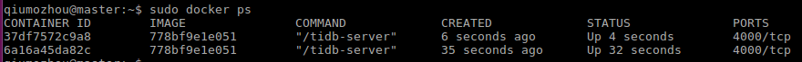
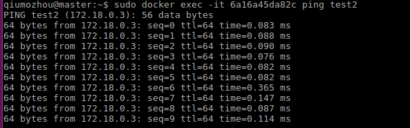

### 01、创建桥接网络
执行`docker network create test_net`


### 02、创建测试容器
执行
```
docker run -itd --name=test1 --network test_net --network-alias test1  778bf9e1e051 
docker run -itd --name=test2 --network test_net --network-alias test2  778bf9e1e051

# --network-alias 相当于给IP别名,可直接通过别名访问容器
``` 




### 03、测试通信
执行`docker exec -it e1f1f56aae10 ping test2`,



### 04、yaml文件测试
```
version: '3'
services:
  test1:
    image: 778bf9e1e051
    container_name: test1
    ports:
      - "8002:8002"
    networks:
      - "net1"
  test2:
    image: 778bf9e1e051
    container_name: test1
    ports: 
      - "8001:8001"
    networks:
      - "net1"

networks:
  net1:
    driver: bridge
```