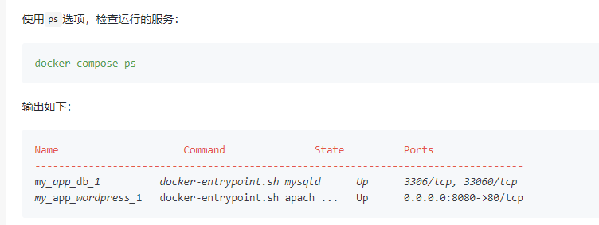

前言:我们使用dockerhub或者阿里云的docer仓库时,要么面临网速慢的问题，要么面临使用成本的问题,
因此搭建自己的docker仓库不失为一个好的选择


### 01、拉取Register镜像
执行`docker pull registry`




### 02、启动服务
```
docker run -d \
    -p 5000:5000 \
    -v /home/qiumozhou/Desktop/hub:/var/lib/registry \
    registry

#/home/qiumozhou/Desktop/hub  本地存放docker镜像的目录
```


### 03、打包镜像
把目标镜像打包成规定的格式
```
docker tag python:latest  127.0.0.1:5000/python:v1.0

注意:前缀必须为127.0.0.1:5000/
```


### 04、镜像上传
上传打包好的镜像
```
docker push 127.0.0.1:5000/python:v1.0
```


### 05、查看仓库中的镜像
执行`curl 127.0.0.1:5000/v2/_catalog`


### 06、拉取镜像
执行`docker pull 127.0.0.1:5000/python:v1.0`

