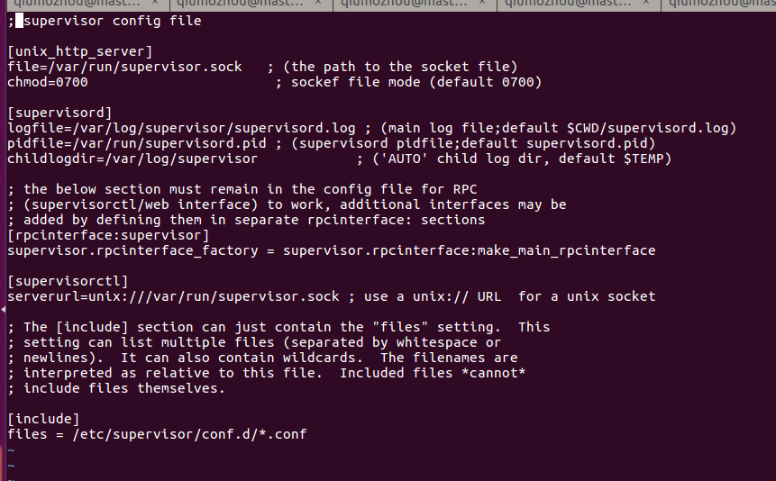

### 01、安装sipervisor
执行`apt-get install supervisor`


### 02、查看配置文件
安装成功后，会在/etc/supervisor目录下，生成supervisord.conf配置文件


### 03、新建配置文件
进程配置会读取/etc/supervisor/conf.d目录下的*.conf配置文件，我们在此目录下创建一个hwapp.conf进程配置文件：
```
[program:hwapp]
directory=/homo/qiumozhou/test
command=./start.sh
autostart=true
autorestart=true
startretries=10
redirect_stderr=true
stdout_logfile=/usr/log/superviser
environment=ASPNETCORE_ENVIRONMENT="Development"
```

### 04、启动supervisor
执行`supervisord`

常用命令:
| 命令 | 说明 |
| ---------- | --------------------------- |
| supervisorctl stop program_name	| 停止某个进程 |
| supervisorctl start program_name	| 启动某个进程 |
| supervisorctl restart program_name	| 重启某个进程 |
| supervisorctl stop all	| 停止全部进程 |
| supervisorctl reload	| 载入最新的配置文件，停止原有进程并按新的配置启动、管理所有进程 |
| supervisorctl update	| 根据最新的配置文件，启动新配置或有改动的进程，配置没有改动的进程不会受影响而重启 |
| supervisorctl status | 查看所有进程状态 |