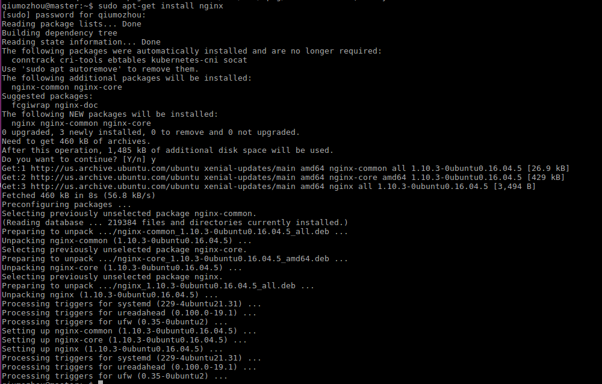

### 01、安装nginx 

执行`sudo apt-get install nginx`,如果失败就更新下镜像源



### 02、启动nginx

执行`nginx`


### 03、nginx配置文件详解

配置文件路径为/etc/nginx/nginx.conf,详解如下:
```
user root;                                    #以哪个用户启动nginx
worker_processes auto;                        #nginx使用cpu核数
pid /run/nginx.pid;                           #nginx进程存放路径
include /etc/nginx/modules-enabled/*.conf;    #模块配置 

events {
        worker_connections 768;
        # multi_accept on;
}

http {

        ##
        # Basic Settings
        ##

        sendfile on;
        tcp_nopush on;
        tcp_nodelay on;
        keepalive_timeout 65;                       #单个连接超时时间
        types_hash_max_size 2048;
        # server_tokens off;

        # server_names_hash_bucket_size 64;
        # server_name_in_redirect off;

        include /etc/nginx/mime.types;
        default_type application/octet-stream;

        ##
        # SSL Settings
        ##

        ssl_protocols TLSv1 TLSv1.1 TLSv1.2; # Dropping SSLv3, ref: POODLE
        ssl_prefer_server_ciphers on;

        ##
        # Logging Settings
        ##

        access_log /var/log/nginx/access.log;             #请求日志
        error_log /var/log/nginx/error.log;               #错误日志

        ##
        # Gzip Settings
        ##

        gzip on;                                            #是否通过压缩流传递数据，一定程度上加快速度

        # gzip_vary on;
        # gzip_proxied any;
        # gzip_comp_level 6;
        # gzip_buffers 16 8k;
        # gzip_http_version 1.1;
        # gzip_types text/plain text/css application/json application/javascript text/xml application/xml application/xml+rss text/javascript;

        ##
        # Virtual Host Configs
        ##

        include /etc/nginx/conf.d/*.conf;                # 子配置文件路径，用户可以添加自己的nginx配置
        include /etc/nginx/sites-enabled/*;
}
                                                             
```

### 04、添加配置文件

在/etc/nginx/conf.d/文件夹中新建base.conf文件,输入以下内容:
```
server {
        listen       80;
        server_name  localhost;


        location / {
            root  /home/ubuntu/vuepress/docs/.vuepress/dist;#前端dist文件存放路径或者是index.html的路径
            index  index.html index.htm;
        }

        error_page   500 502 503 504  /50x.html;
        location = /50x.html {
            root   html;
        }


    }


```


### 05、重启nginx
执行`nginx -s reload`


