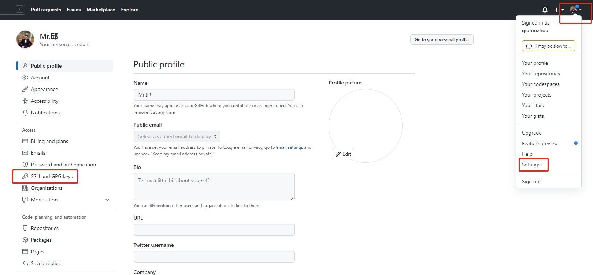

### 01、安装git
执行`sudo apt-get install git`

### 02、配置git全局环境
```
git config --global user.name "用户名"
git config --global user.email "邮箱地址"
```

### 03、生成ssh密钥
执行`ssh-keygen -C 'you email address@gmail.com' -t rsa`
会在用户目录~/.ssh/下建立相应的密钥文件。

### 04、创建完公钥后，需要上传。
使用命令`cd ~/.ssh`进入"~/.ssh"文件夹，输入`cat id_rsa.pub`
打开id_rsa.pub文件，复制其中所有内容。接着访问git网页，点击SSH公钥，标题栏可以随意输入，公钥栏把刚才复制的内容粘贴进去。


### 05、测试连接
执行`ssh -T git@github.com`

### 06、git使用命令
```
git branch -a 查看所有分支
git checkout [name] 切换分支
git add . 
git commit -a 提交当前repo的所有的改变
git push  将本地项目给提交到服务器中
git merge [dev] 将分支dev与当前分支进行合并
git checkout -b [name]  创建新分支并立即切换到新分支
git branch -d [name]   删除分支
git push origin :heads/[name]  删除远程分支
git tag 查看版本
git tag [name] 创建版本
git tag -d [name] 删除版本
git push origin [name] 创建远程版本(本地版本push到远程)
git push origin :refs/tags/[name] 删除远程版本
git pull origin --tags 合并远程仓库的tag到本地
git push origin --tags 上传本地tag到远程仓库
git tag -a [name] -m 'yourMessage' 创建带注释的tag
```

