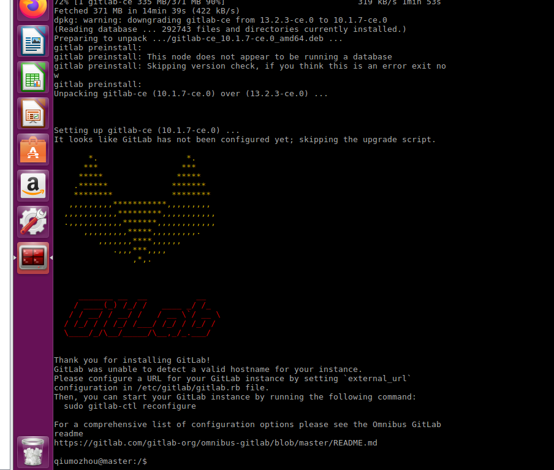
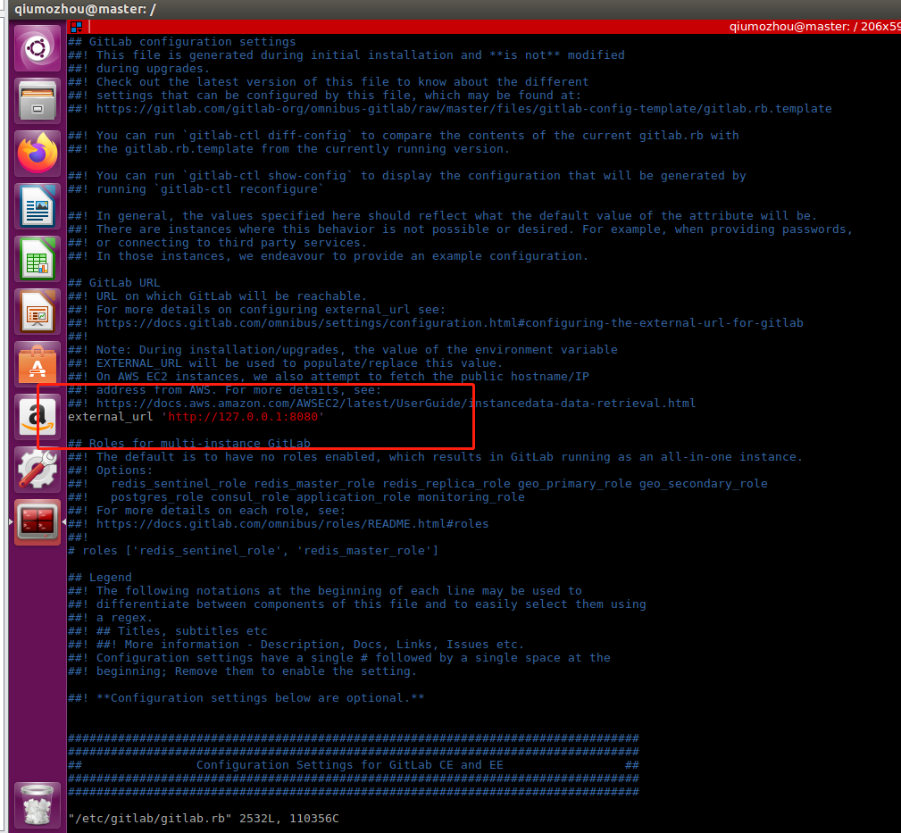
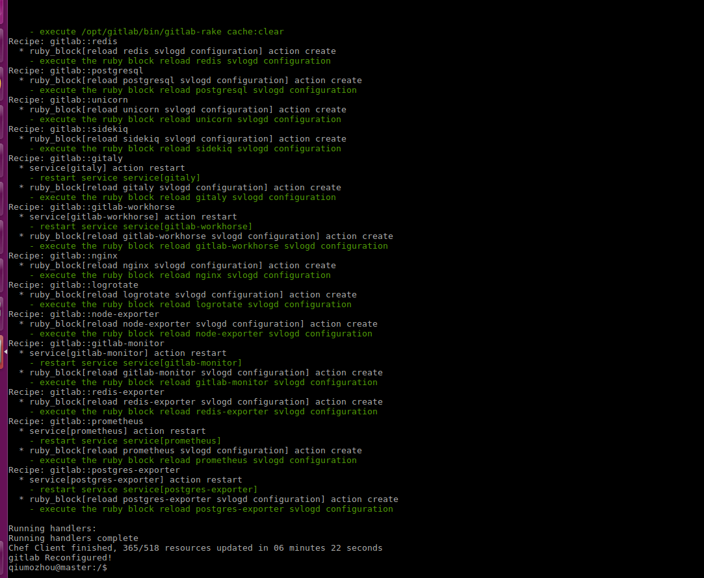
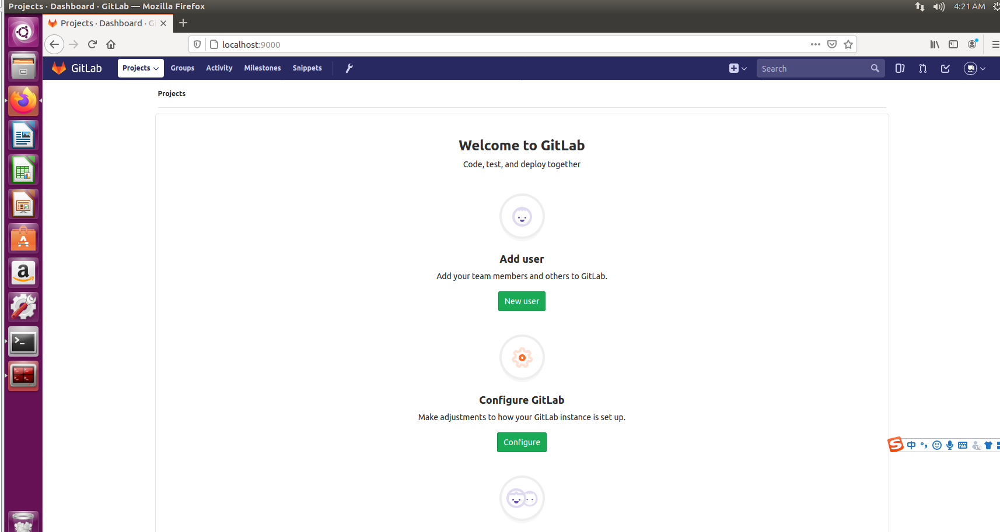

前言:目前中小型企业内部的版本管理工具一般都是git系，svn渐渐退出历史的舞台，企业内部一般会自建git版本管理，毕竟互联网代码还是很重要的，自建能一定程度保证公司的代码安全。


### 01、安装依赖包
执行
```
sudo apt-get update

sudo apt-get install -y curl openssh-server ca-certificates 
```

### 02、邮件配置
执行`sudo apt-get install -y postfix`
选择`internet site`
输入`master`


### 03、配置公钥
执行`curl https://packages.gitlab.com/gpg.key 2> /dev/null | sudo apt-key add - &>/dev/null`


### 04、修改镜像源
把`deb https://mirrors.tuna.tsinghua.edu.cn/gitlab-ce/ubuntu xenial main`写入
`/etc/apt/sources.list.d/gitlab-ce.list`


### 05、开始安装
```
sudo apt-get update
sudo apt list gitlab-ce -a
sudo apt-get install -f gitlab-ce

#安装指定版本
sudo apt-get install -f gitlab-ce=12.3.6-ce.0
一定要选对符合自己服务器的版本,不然会出现问题,我踩了很长时间的坑,在这里
```


### 06、修改配置文件
打开`sudo vim /etc/gitlab/gitlab.rb`,把文件中的
external_url 'http://localhost' 修改为`externa_url 'http://127.0.0.1:8080'`
打开`sudo vim /var/opt/gitlab/gitlab-rails/etc/unicorn.rb`,把文件中的listen "127.0.0.1:8080",
修改为`listen "127.0.0.1:8080"`(低版本的没有)




### 07、重启配置
执行`sudo gitlab-ctl reconfigure`



### 08、重启服务
执行`sudo gitlab-ctl restart`

### 09、打开sshd和postfix服务
执行`service sshd start`,`service postfix start`


### 10、访问服务
`http://127.0.0.1:8080`
内存至少4g,因为我这里虚拟机只有2g,所以报错了,下次有条件了更新吧


换了4g内存之后的

