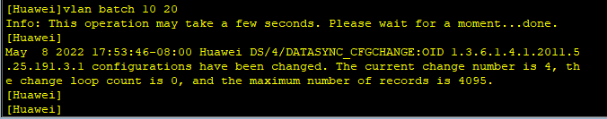
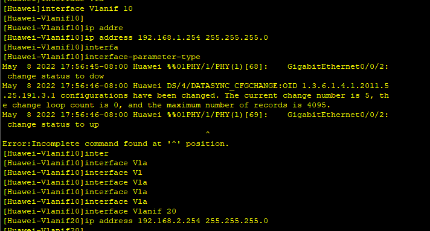
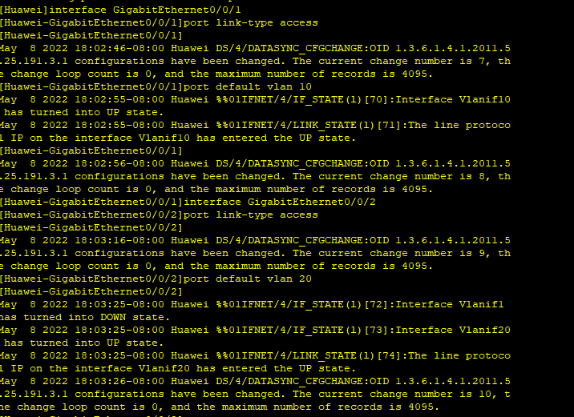
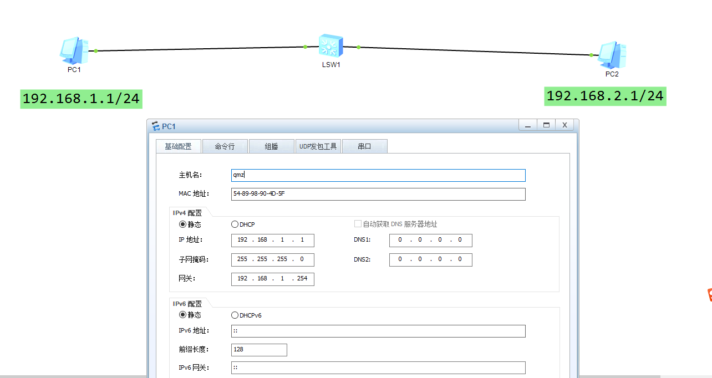
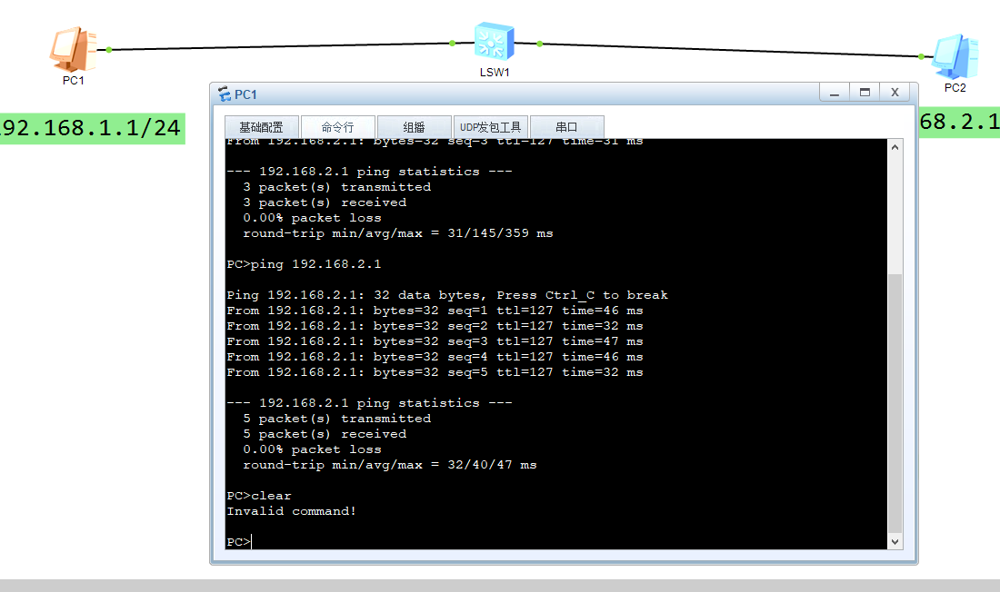

### 01、创建vlan
打开交换机,配置两个vlan,用来分割广播域
执行`vlan batch 10 20`,会创建vlan10和vlan20

### 02、给vlan配置ip
执行`interface Vlanif10`,`ip address 192.168.1.254 255.255.255.0`
执行`interface Vlanif20`,`ip address 192.168.2.254 255.255.255.0`

### 03、将交换机接口跟vlan绑定
执行`interface GigabitEthernet0/0/1`,`port link-type access`,`port default vlan 10`
执行`interface GigabitEthernet0/0/2`,`port link-type access`,`port default vlan 20`

### 04、配置电脑ip
置PC的基本配置，网关设置为交换机VLAN的IP

### 05、测试通信

