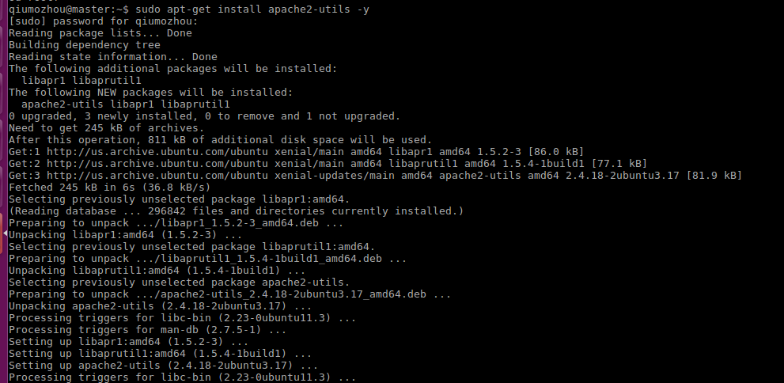
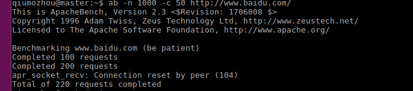
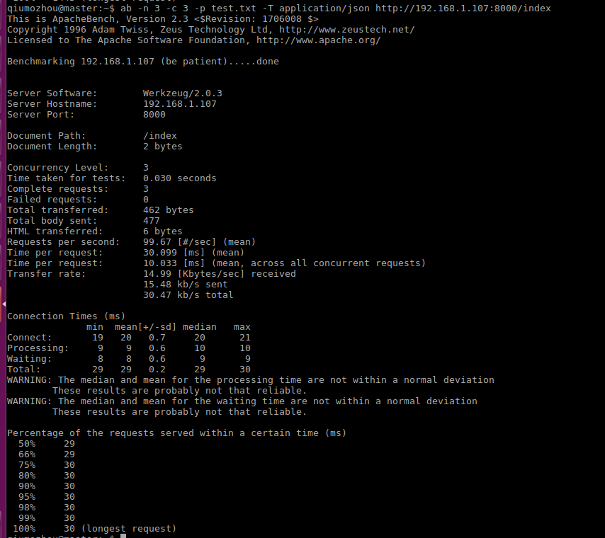

### 01、安装ab
执行`apt-get install apache2-utils -y`



### 02、执行测试
`ab -n 1000 -c 50 http://www.baidu.com/`



```
参数解释
-N|--count 总请求数，缺省 : 5w
-C|--clients 并发数, 缺省 : 100
-R|--rounds 测试次数, 缺省 : 10 次
-S|-sleeptime 间隔时间, 缺省 : 10 秒
-I|--min 最小并发数,　缺省: 0
-X|--max 最大并发数，缺省: 0
-J|--step 次递增并发数
-R|--runtime 总体运行时间,设置此项时最大请求数为5w
-P|--postfile post数据文件路径
-U|--url 测试地址

模拟post请求
eg:
ab -n 3 -c 3 -p test.txt -T application/json http://192.168.1.107:8000/index


#test.txt里面写jon格式的数据就可以了
```

