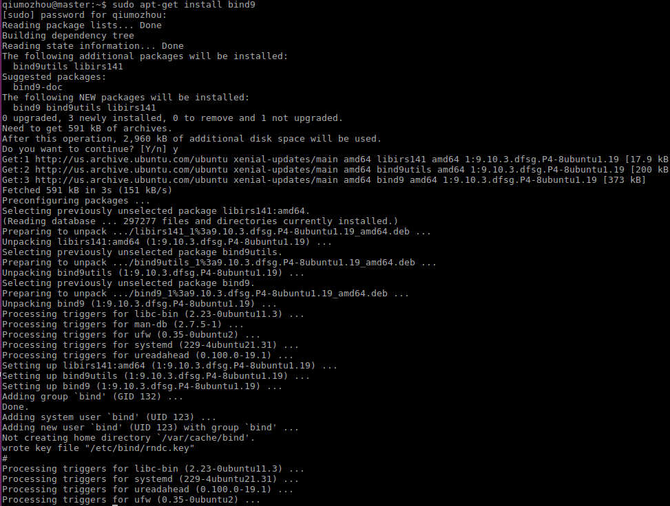
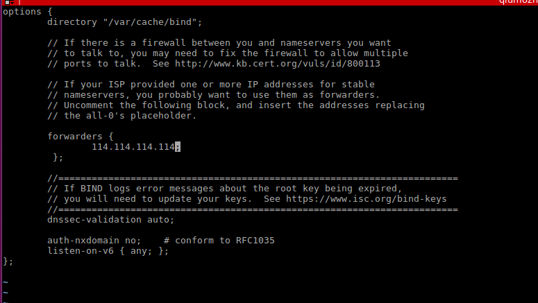
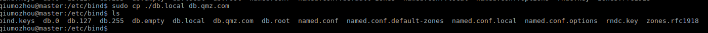
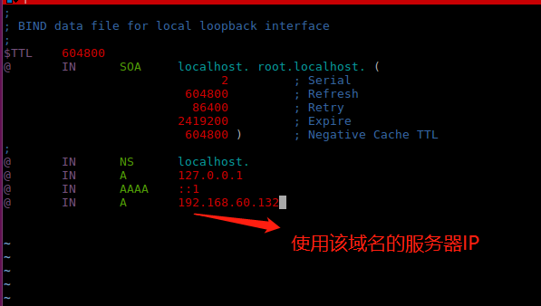
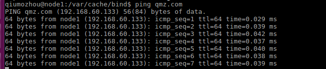

前言:自己搭建内网DNS服务器，帮助内网网络安全


### 01、安装bind9服务
执行`sudo apt-get install bind9`




### 02、编辑forward,指定外网dns服务器
执行`sudo vi /etc/bind/named.conf.options`,修改forwarders 



### 03、配置内网域名
执行`sudo vim /etc/bind/named.conf.local`
拷贝如下内容:
```
zone "qmz.com"{
    type master;
    file "db.qmz.com"
};
```

### 04、创建内网域名配置文件
执行`sudo cp ./db.local db.qmz.com`,并移动至`/var/cache/bind`目录下



### 05、修改内网域名配置文件
执行`sudo vim ./db.qmz.com`,添加`@       IN      A       192.168.60.132`



### 06、重启bind9服务,重置电脑dns服务器地址
执行`sudo service bind9 restart`,同时重置电脑的dns服务器地址

