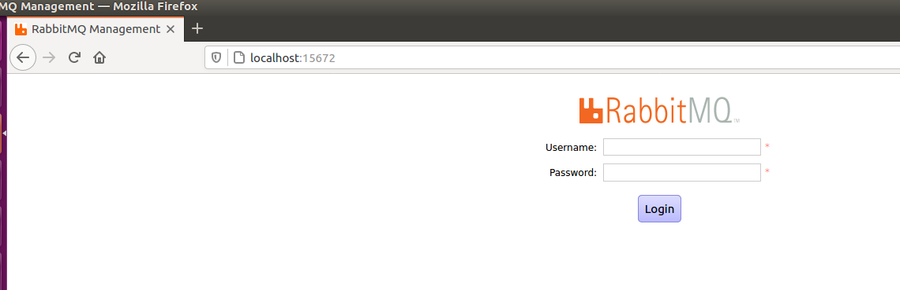
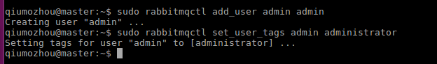
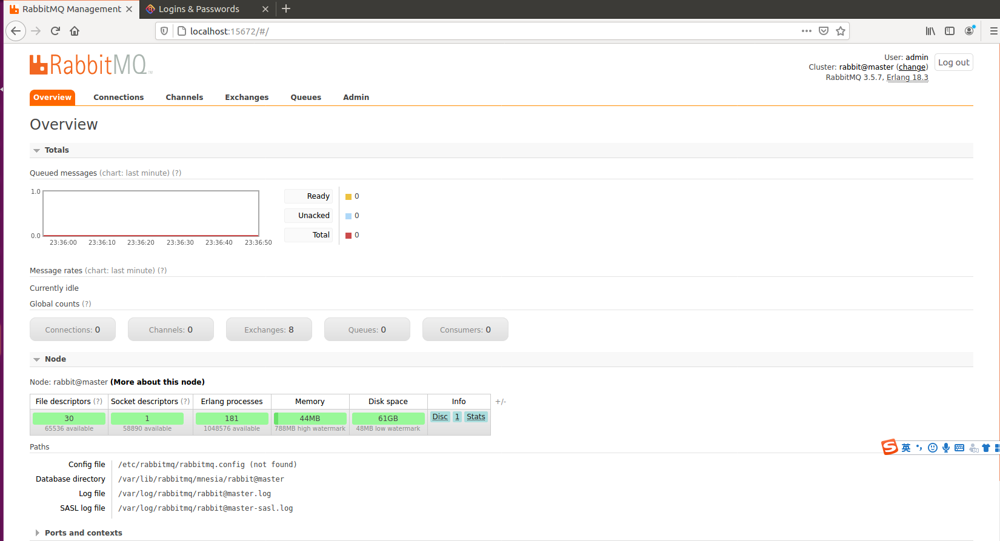

### 01、安装erlang
因为rabbit是erlang语言开发的,所以先安装好环境.
执行`sudo apt-get install erlang`


### 02、安装rabbitMQ
执行`sudo apt-get install rabbitmq-server`


### 03、安装web管理界面
执行`sudo rabbitmq-plugins enable rabbitmq_management`
然后访问`localhost:15672`




### 04、创建管理员账号
```
sudo rabbitmqctl add_user admin admin
sudo rabbitmqctl set_user_tags admin administrator
```





