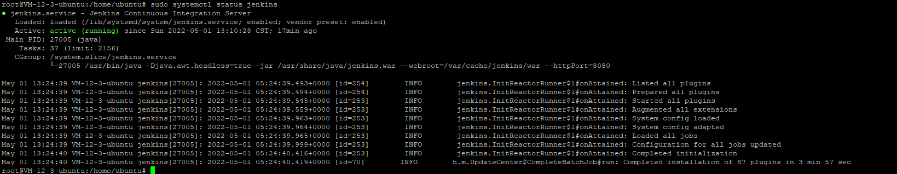
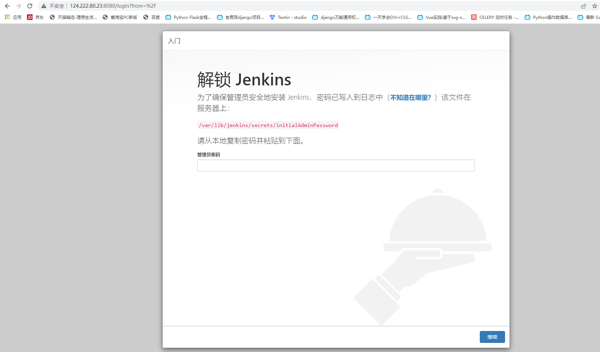
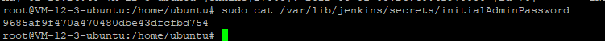
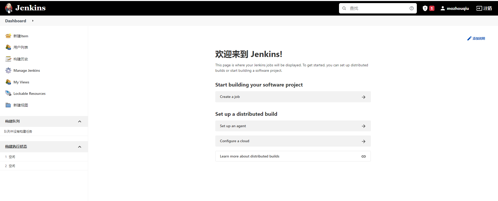

### 01、安装jdk
执行`sudo apt-get install openjdk-11-jdk`,安装完成后查看jdk版本`java -version`

### 02.安装存储秘钥
执行`wget -q -O - https://pkg.jenkins.io/debian-stable/jenkins.io.key | sudo apt-key add -`

### 03、添加镜像源
执行`sudo sh -c 'echo deb https://pkg.jenkins.io/debian-stable binary/ > /etc/apt/sources.list.d/jenkins.list'`

### 04、更新镜像源
执行`sudo apt-get update`

### 05、安装jenkins
执行`apt-get install jenkins`

### 06、启动jenkins
执行`sudo systemctl start jenkins`

### 07、查看jenkins状态
执行`sudo systemctl status jenkins`

### 08、访问jenkins
浏览器中输入`http://192.168.1.1:8080`

### 09、获取初始密码
执行`sudo cat /var/lib/jenkins/secrets/initialAdminPassword`

最终效果图:

