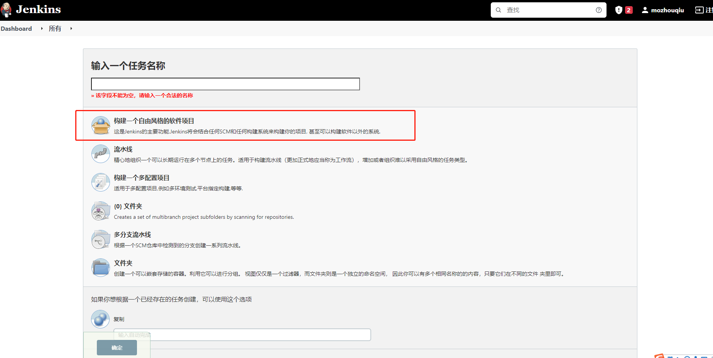
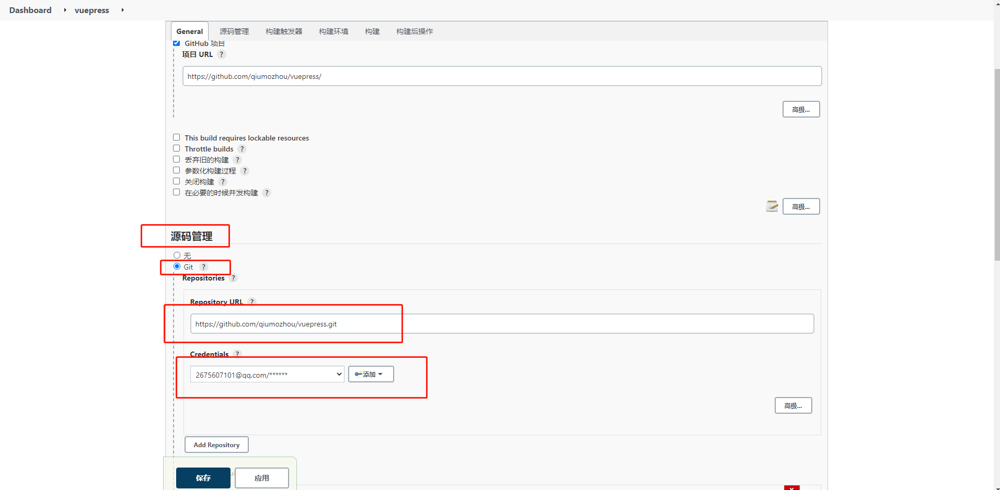
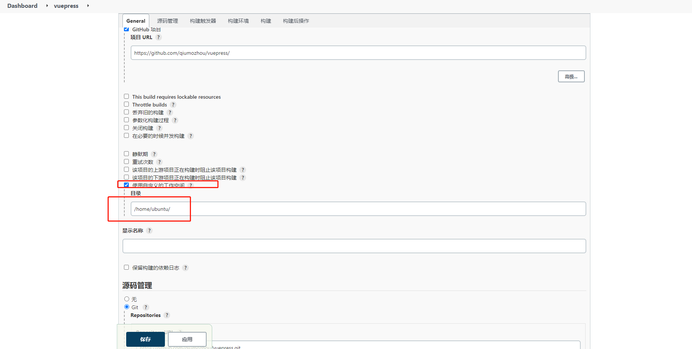
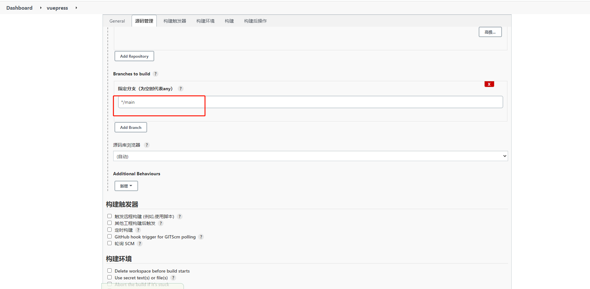
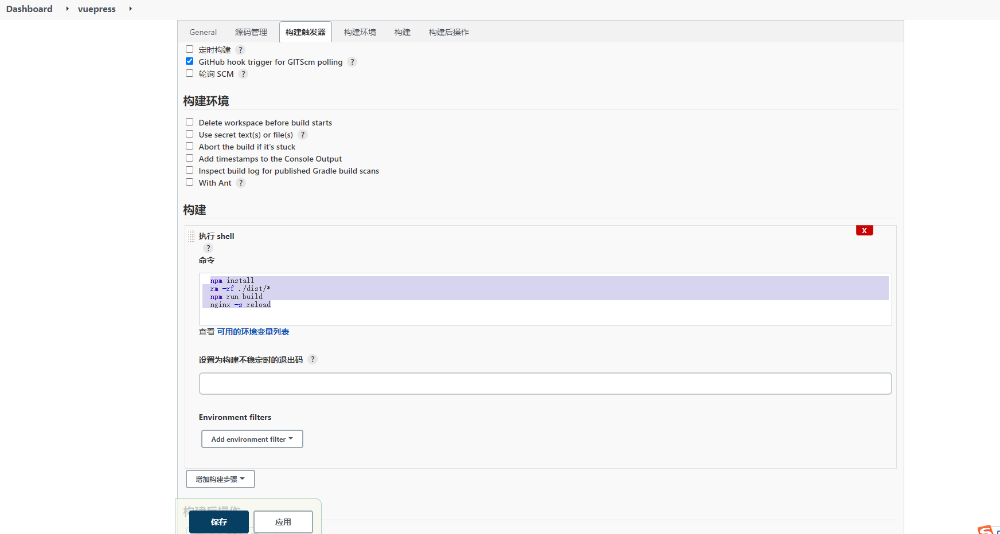
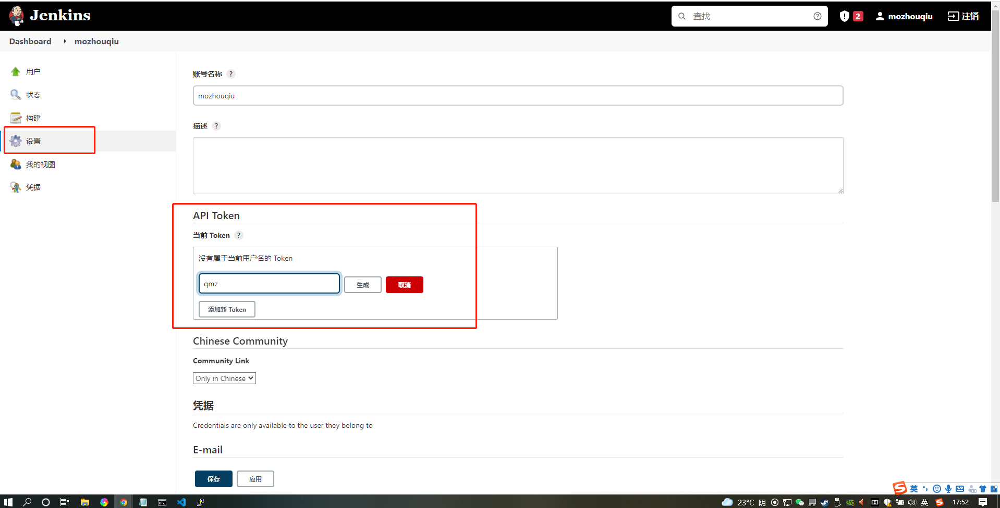
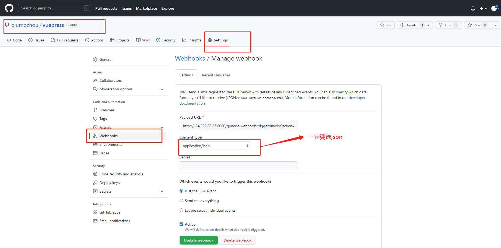
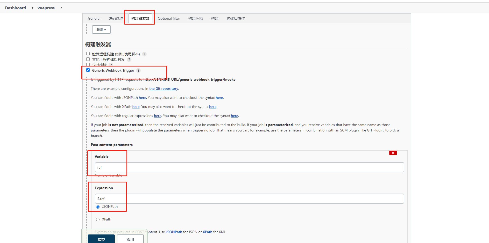
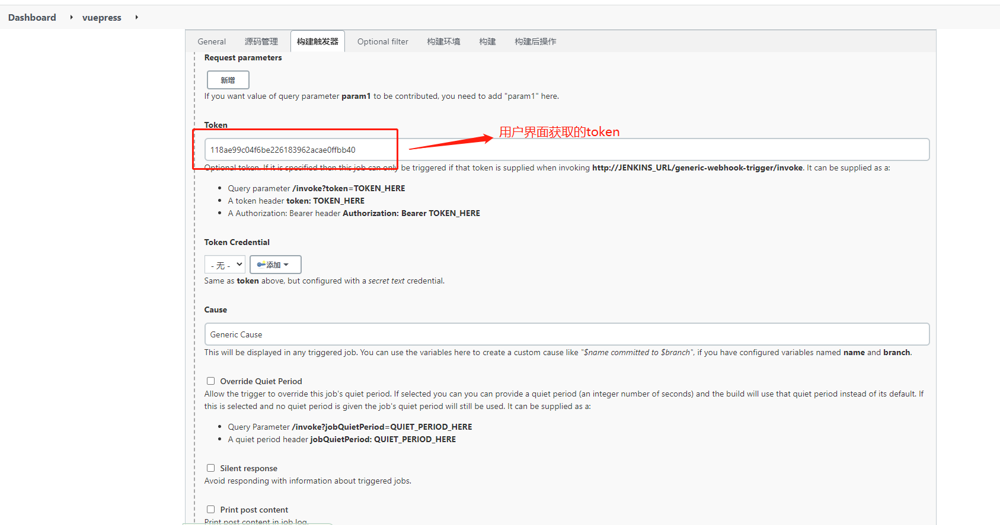
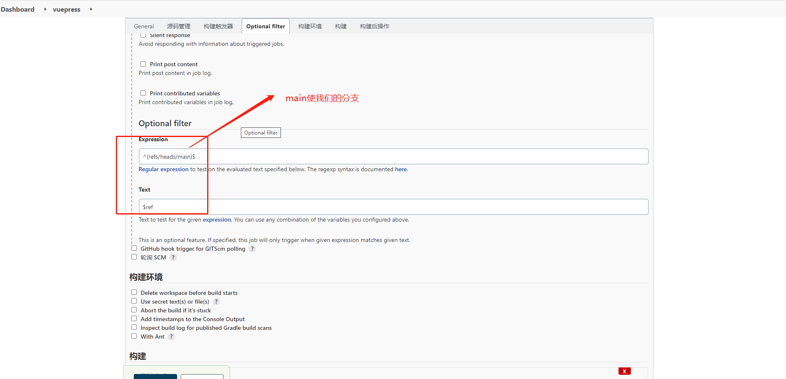

前言:genkins已安装Generic Webhook Trigger插件


### 01、创建项目




### 02、配置git仓库




### 03、配置工作目录
注意：在General中选择"高级"才会出现此选项




### 04、选择repo分支




### 05、修改工作目录权限
在`/home/ubuntu`下执行`chown jenkins:jenkins ubuntu`


### 06、修改nginx权限
在`/usr/sbin`下执行`chown root nginx`,`chmod u+s nginx`


### 07、添加构建命令
```
npm install 
rm -rf ./dist/*
npm run build
nginx -s reload
```



### 08、构建token




### 09、github配置webhook
格式为
```
http://<您的jenkins访问路径>/generic-webhook-trigger/invoke?token=<您刚刚复制的token>
```


### 10、jenkins配置webhook
```
常用参数
ref
$.ref
^(refs/heads/main)$
$ref
```






结语:只要我们提交代码,jenkins会自动帮我们完成服务的重新发布


