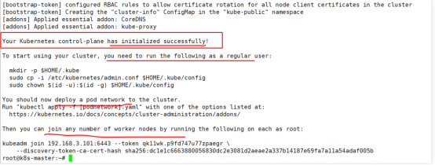

#### 硬件需求:    
            内存>=4GB
            硬盘空间>=20GB

#### 软件需求:  
            ubuntu-16.04操作系统


## 01、系统检查
- 禁用swap分区

- 关闭防火墙

#### 禁用swap分区

1.进入系统右击鼠标点击“在终端中打开”

2.输入命令 `sudo vim /etc/fstab` 编辑fstab文件

3.键盘输入 i 进入插入模式就可以对文件进行编辑了

4.将UUID=xxx… swap那一行的最前面添加 # 把这行注释

5.按Esc键,再按shift键+:键,输入wq,按Enter键保存

#### 关闭防火墙
1.首先打开Ubuntu的终端命令行 

2.查看当前防火墙状态,使用`sudo ufw status`命令查看当前防火墙状态;inactive状态是防火墙关闭状态 active是开启状态。

3.使用`sudo ufw disable`命令来关闭防火墙。执行该命令之后 我们使用sudo ufw status命令来查看当前防火墙的状态 如果是inactive 说明我们的防火墙已经关闭掉了。


## 02、安装Docker-ce

1.首先打开Ubuntu的终端命令行 

2.输入
```commandline
sudo apt-get install apt-transport-https ca-certificates curl software-properties-common

```


3.输入
```commandline
sudo curl -fsSL https://download.docker.com/linux/ubuntu/gpg | sudo apt-key add  -

```

4.输入
```commandline
sudo add-apt-repository  "deb [arch=amd64] https://download.docker.com/linux/ubuntu $(lsb_release -cs) stable"
```

5.输入
```commandline
sudo apt-get update

```

6.输入
```commandline
sudo apt-get install docker-ce=5:20.10.7~3-0~ubuntu-xenial

```

7.输入`docker -v`,显示Docker version 20.10.7,说明已经安装成功.(注意：如果系统已存在docker，但版本不是 20.10.7，请卸载重装)


## 03、安装kubeadm
- 安装kubeadm
- 配置kubelet禁用swap

#### 安装kubeadm

1.首先打开Ubuntu的终端命令行 

2.激活root账户,输入`sudo passwd root`,按提示输入密码,最好跟sudo的密码保持一致

3.切换roo账户，输入`su root`,再输入root账户密码

4.输入`apt-get update && apt-get install -y apt-transport-https`

5.输入`curl -fsSL https://mirrors.aliyun.com/kubernetes/apt/doc/apt-key.gpg | apt-key add -`

6.输入`add-apt-repository "deb [arch=amd64] https://mirrors.aliyun.com/kubernetes/apt/ kubernetes-xenial main"`

7.输入`apt-get update`

8.输入`apt install -y kubelet=1.15.4-00 kubectl=1.15.4-00 kubeadm=1.15.4-00 `


#### 配置kubelet禁用swap
1.首先打开Ubuntu的终端命令行

2.输入`tee /etc/default/kubelet <<-'EOF'
KUBELET_EXTRA_ARGS="--fail-swap-on=false"
EOF `

3.输入`systemctl daemon-reload && systemctl restart kubelet`


## 04、初始化k8s
- 初始化k8s
- kubectl配置调用
- 配置k8s网络

#### 初始化k8s

1.重启电脑,然后打开Ubuntu的终端命令行,切换至root账户

2.输入`kubeadm init \
  --kubernetes-version=v1.15.4 \
  --image-repository registry.aliyuncs.com/google_containers \
  --pod-network-cidr=10.24.0.0/16 \
  --ignore-preflight-errors=Swap`
整个初始化过程会花几分钟，请耐心等待



出现红框中的内容时，代表初始化成功

#### kubectl配置调用
1.打开Ubuntu的终端命令行,切换至root账户

2.输入`mkdir -p $HOME/.kube`

3.输入`cp -i /etc/kubernetes/admin.conf $HOME/.kube/config`

4.输入`chown $(id -u):$(id -g) $HOME/.kube/config`


#### 配置k8s网络

1.打开Ubuntu的终端命令行,切换至root账户

2.输入`kubectl apply -f https://raw.githubusercontent.com/coreos/flannel/master/Documentation/kube-flannel.yml`

3.输入`kubectl get pods -A`,会看到服务都启动成功并正常运行

4.如果coredns两个服务状态不为running,请执行以下步骤进行修复。
- 4.1打开Ubuntu的终端命令行,切换至root账户
- 4.2 输入 `kubectl edit cm coredns -n kube-system`
- 4.3 删除 loop 保存并退出
- 4.4 重启 coredns pods,输入`kubectl delete pod coredns-xxx-xxxx -n kube-system`即可(中间xxx需要替换)
- 4.5 输入`kubectl get pods -A`,会看到coredns服务都正常运行