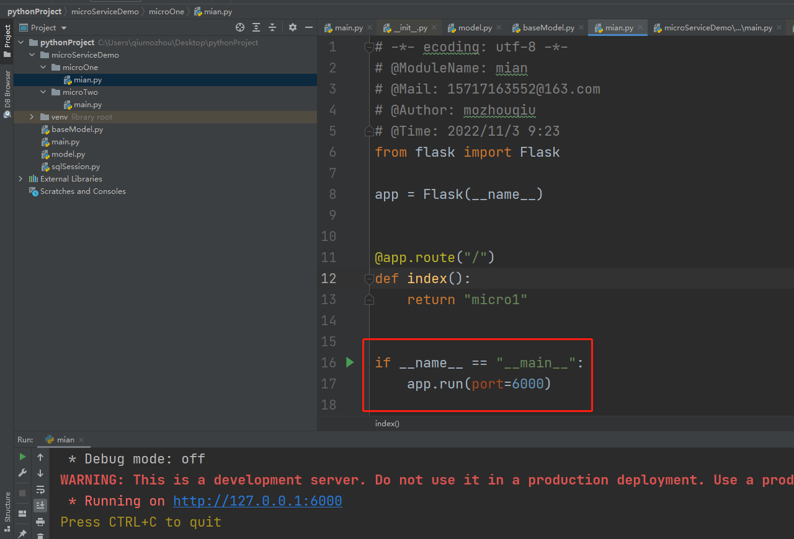

前言:Gateway本质上是一个路由转发器。将外界的请求转发到内部不同的微服务。


### 01、创建微服务
代码如下:
```
# -*- ecoding: utf-8 -*-
# @ModuleName: mian
# @Mail: 15717163552@163.com
# @Author: mozhouqiu
# @Time: 2022/11/3 9:23
from flask import Flask

app = Flask(__name__)


@app.route("/")
def index():
    return "micro1"


if __name__ == "__main__":
    app.run(port=6000)

```
创建两个服务,用端口号区分服务.如下图:
   


### 02、flask+requests实现gateWay服务
代码如下:
```
# -*- ecoding: utf-8 -*-
# @ModuleName: main
# @Mail: 15717163552@163.com
# @Author: mozhouqiu
# @Time: 2022/11/3 10:01
from flask import Flask,request,redirect
import requests


app = Flask(__name__)
@app.before_request


#路由拦截
def before_request():
    serveiceName = parseUrl()
    return requests.get(serviceConfig[serveiceName]).text

#以下为另外两个微服务的服务配置。相当于微服务的注册中心
serviceConfig = {
    "open":"http://localhost:6000/",
    "bs": "http://localhost:7000/"
}


#路由解析
def parseUrl():
    return request.url.split('/')[3]


if __name__ == "__main__":
    app.run(port=8000)
```


### 03.访问微服务
启动两个微服务及gateWay服务
浏览器访问"http://127.0.0.1:8000/bs","http://127.0.0.1:8000/open".
最终发现虽然我们访问的是网关服务的接口,但是返回的却是两个微服务的接口内容.


